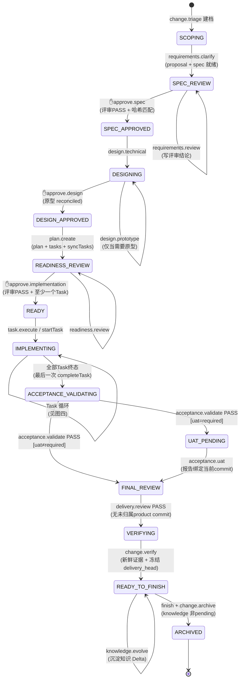
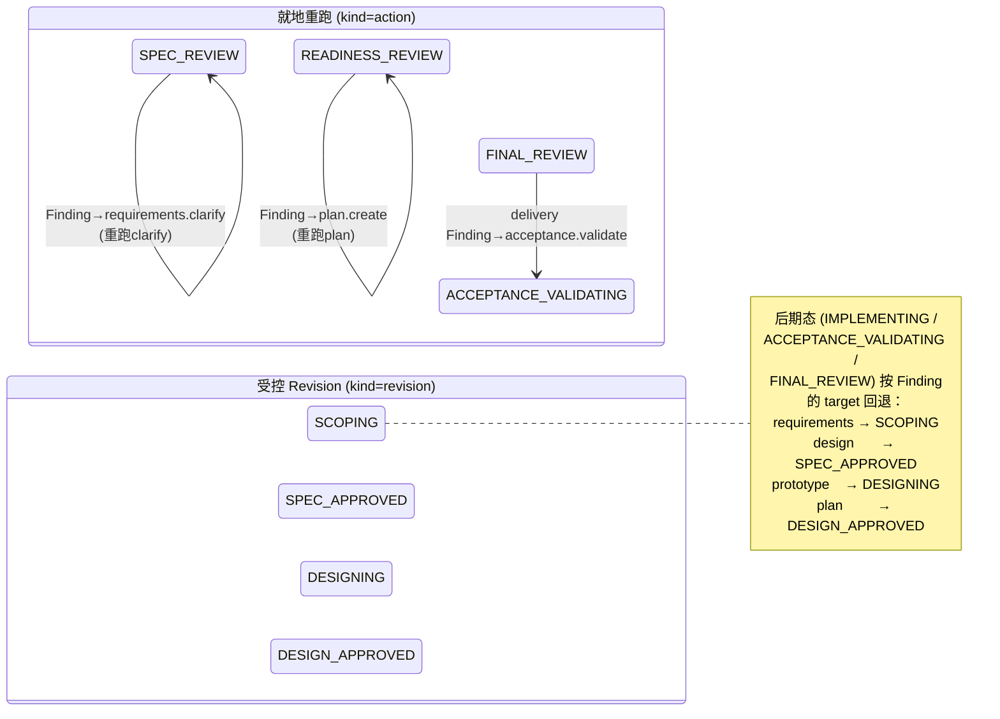
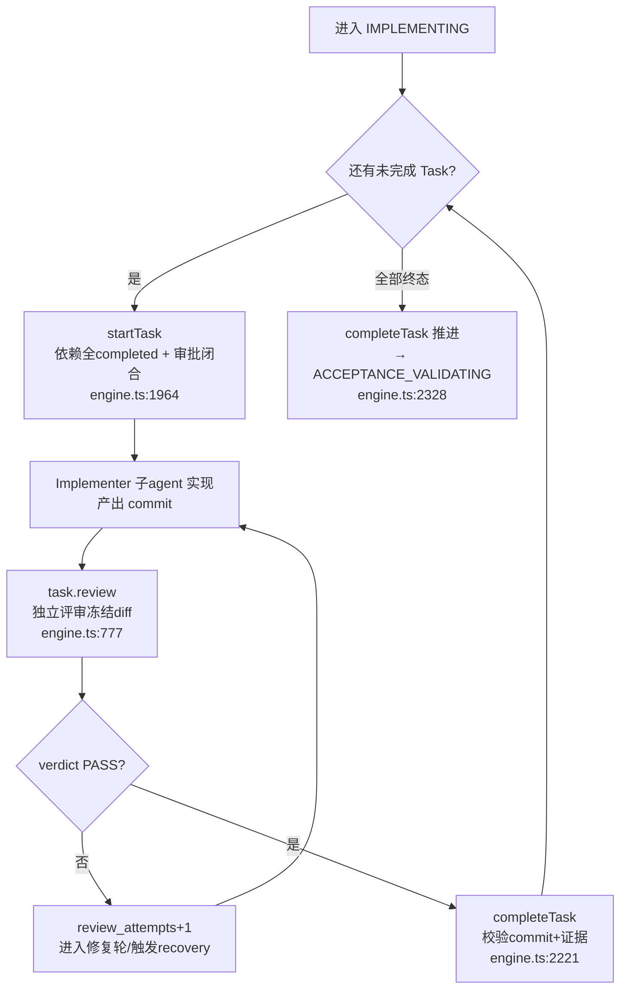
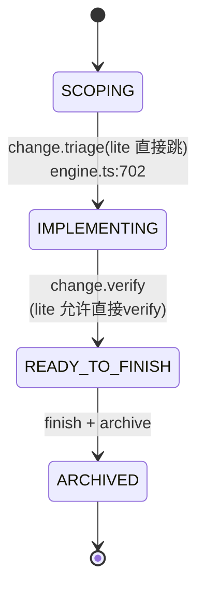

# RockSpec Engine 流程驱动全景

> 目的：一图看懂 Engine 如何驱动一次受治理 Change 从建档到归档的完整生命周期。
> 依据：`packages/engine/src/engine.ts`、`packages/engine/src/workflow.ts`、`packages/protocol/src/constants.ts` 源码精读（行号为撰写时快照）。
> 核心原则：**Engine 是 attached change 状态的唯一写入者**。Skill 只编排 agent 产出产物并提交动作，状态如何流转、门禁是否放行，全由 Engine 依据产物与证据判定。

---

## 一、驱动模型：三类驱动器

Engine 的状态机不是单一函数推进的，而是由三类入口协同驱动：

| 驱动器 | 方法 | 职责 |
|---|---|---|
| **普通动作** | `completeAction()` (engine.ts:667) | 处理大部分 ACTION_ID，写产物引用、跑校验、推进状态 |
| **专用方法** | `promote/verify/archive/completeUat/startTask/completeTask/approve` | 四个动作被分流到独立方法；审批门与 Task 生命周期也独立 |
| **回环** | `revise/amendRevision` + `apply*Invalidation` + `completeReconciliation` | review 发现 Finding 后，把状态受控回退到上游并重新收敛 |

**关键事实**（画图时反复用到）：
- 审批门动作 `approve.spec/design/implementation` **不是 ACTION_ID**，走独立 `approve()` (engine.ts:977)，由 `workflowAdvice` 在 review PASS 后推荐。
- `task.execute` 是占位动作，真正推进 Task 的是 `startTask()`/`completeTask()`。
- 合法动作由 `assertActionAllowed` 强约束 (workflow.ts:518)。
- 每次 `status` 都会跑 `collectBlockers` (engine.ts:3095) 检查产物哈希是否过期（STALE），过期则阻断推进、强制开 Revision。

---

## 二、主状态机（Standard / Strict Profile）

15 个主线状态的正向流转。菱形为**人工审批停点**（默认），其余为动作驱动的自动流转。

**说明**：
- `requirements.review` / `readiness.review` / `acceptance.validate` / `delivery.review` 这些**评审动作本身不推进状态**（PASS 前状态原地不动），它们只写评审结论；真正推进的是随后的审批门或（PASS 时的）自动跳转。
- 三个 `✋` 审批门（spec / design / implementation）默认是**人工停点**，需要用户确认 + 哈希匹配才放行 (engine.ts:989-996)。

---

## 三、回环机制：Finding 如何把状态拉回上游

评审发现问题（`CHANGES_REQUIRED` + open Finding）时，Engine 依据 Finding 的 `route_to` 决定回环方式。由 `recoveryDirective` (workflow.ts:167) 统一路由，分**就地重跑**与**受控 Revision**两类。

### 回环规则表

| Finding `route_to` | 回环类型 | target | 回退到 | 证据 |
|---|---|---|---|---|
| requirements.clarify | upstream revision | requirements | `SCOPING` | workflow.ts:153, engine.ts:6413 |
| design.technical | upstream revision | design | `SPEC_APPROVED` | workflow.ts:154 |
| design.prototype | upstream revision | prototype | `DESIGNING` | workflow.ts:155 |
| plan.create | upstream revision | plan | `DESIGN_APPROVED` | workflow.ts:156 |
| task.execute（非 task.review 触发） | remediation | plan | `DESIGN_APPROVED` | workflow.ts:227 |
| requirements（SPEC_REVIEW 内，无 revision） | 就地 action | — | 原地重跑 clarify | workflow.ts:193 |
| plan.create（READINESS 内，全部指向 plan） | 就地 action | — | 原地重跑 plan | workflow.ts:202 |
| acceptance.validate（FINAL_REVIEW 内） | 就地 action | — | `ACCEPTANCE_VALIDATING` | workflow.ts:261, engine.ts:906 |

### upstream revision vs remediation task

- **upstream revision**：Finding 指向 requirements/design/prototype，要改的是**上游规格产物**，`affected_ids` 必须非空 (engine.ts:1405)。
- **remediation task**：Finding 指向 task.execute 但非 task.review 触发（即后期评审发现需补 Task），target 强制为 `plan`，新增/替换 Task 而**不动上游授权**，旧 Task 置 suspended→superseded (engine.ts:4416)。

### Revision 收敛：人工重批 vs 自动对账

Revision 修完后如何重新通过被作废的审批门，由 `gate_policies` 决定 (engine.ts:119)：

| 策略 | 行为 |
|---|---|
| `preserve` | 该门未被 Revision 作废，审批保留，无需重做 |
| `auto` | 走 `reconcile.{spec/design/implementation}` —— 独立 AI 复核自动重批（engine.ts:1253：reconcile PASS → SPEC_APPROVED / DESIGN_APPROVED / READY） |
| `human` | 必须人工重走 approve。authority 变化、非自动分类、或 reconcile 超轮/不收敛时**强制** (engine.ts:1211) |

> 首次审批永远是 human (engine.ts:3453)；auto reconcile 只能续批"已被 Revision 作废"的门。

---

## 四、IMPLEMENTING 内部的 Task 循环

状态停在 `IMPLEMENTING`，由三个专用方法驱动单个 Task 走完，多 Task 依次循环，最后一次 `completeTask` 把状态推向 `ACCEPTANCE_VALIDATING`。

**要点**：
- `startTask` 强制依赖 Task 全部 completed (engine.ts:1996)、三审批门闭合且新鲜 (engine.ts:1977)、无未提交产物。
- `task.review` 的 `scope_blocked` 模式必须记录非 PASS Finding (engine.ts:827)，防止越界改动被放行。
- 全部 Task 终态判定：`every(isTerminalTask)` (engine.ts:2328)，含 completed / superseded。

---

## 五、门禁体系

推进过程中有多道强制门禁，按类型分：

### 5.1 审批门（人工停点）

| 门 | 所在态 | 前置 | 放行后 |
|---|---|---|---|
| spec | SPEC_REVIEW | requirements.review PASS | SPEC_APPROVED |
| design | DESIGNING | design.technical + 原型 reconciled | DESIGN_APPROVED |
| implementation | READINESS_REVIEW | readiness.review PASS + 有 Task | READY |

### 5.2 preflight（进入前硬校验）

| preflight | 合法态 | 强制内容 | 证据 |
|---|---|---|---|
| environment | 任意 | database/browser/credential 探针 | engine.ts:466 |
| implementation | READINESS_REVIEW / READY / IMPLEMENTING | workspace 绑定 + **environment 必须 valid** + 审批闭合 + readiness PASS + Task 图可运行 + **无未决 recovery** | engine.ts:365 |
| acceptance | ACCEPTANCE_VALIDATING / FINAL_REVIEW | workspace + 无未提交产物 + 已注册 acceptance execution + 报告绑定 commit | engine.ts:426 |

> implementation preflight 会**内联强制**跑 environment preflight，不过则抛 `ENVIRONMENT_PREFLIGHT_FAILED` (engine.ts:378)——环境门是进入实现前的硬门。

### 5.3 STALE 门（防过期）

`collectBlockers` 每次 status 检查：产物哈希变了 → `STALE_APPROVAL`；评审覆盖内容变了 → `STALE_REVIEW` (engine.ts:3108/3131)。命中后 `workflowAdvice` 强制推荐 `revise` 而非直接重批 (workflow.ts:303)。

### 5.4 UAT 门

仅当 `uat.policy === "required"` 时，acceptance.validate PASS 会停在 `UAT_PENDING` (engine.ts:860)，必须 `completeUat` 提交绑定当前 commit 的报告才进 FINAL_REVIEW。optional / not_applicable 直接跳过。

### 5.5 finish / archive 两段式收尾

- **finish** (engine.ts:2406)：state=READY_TO_FINISH + verification passed + knowledge 非 pending。push/local_merge 需先记录决策、再 `--executed` 回填真实 result-ref/commit 才算 completed（防"记录了却没真正发布"的静默失败）。
- **archive** (engine.ts:2514)：finished_at 存在 + delivery_head 与 verification commit 一致且为 HEAD 祖先 → ARCHIVED。

---

## 六、Profile 差异与旁支状态

### Lite 快链

Lite 跳过 requirements/design/plan/review/acceptance 全部治理环节，只保留 triage → 内联实现 → verify → knowledge → archive。

### 旁支状态

- `BLOCKED` / `PAUSED`：不在主线转移里，属外部/异常态。
- `SUPERSEDED`：被后续 Change 取代。
- `change.promote` (engine.ts:1263)：Profile 升级路径（lite→standard→strict），把任意非终态**重置回 SCOPING** 并清空 approvals/reviews——是一条回到起点的特殊边。

---

## 七、一句话总结驱动逻辑

> Skill 编排 agent 产出产物 → 提交动作到 Engine → Engine 校验产物/证据/哈希 → 通过则推进状态、不通过则原地或开 Revision 回退 → 审批门在关键节点要求人工确认 → 全程哈希绑定防篡改与过期。**状态由证据驱动，而非声明驱动**：文字上的"完成"不能通过任何门。
