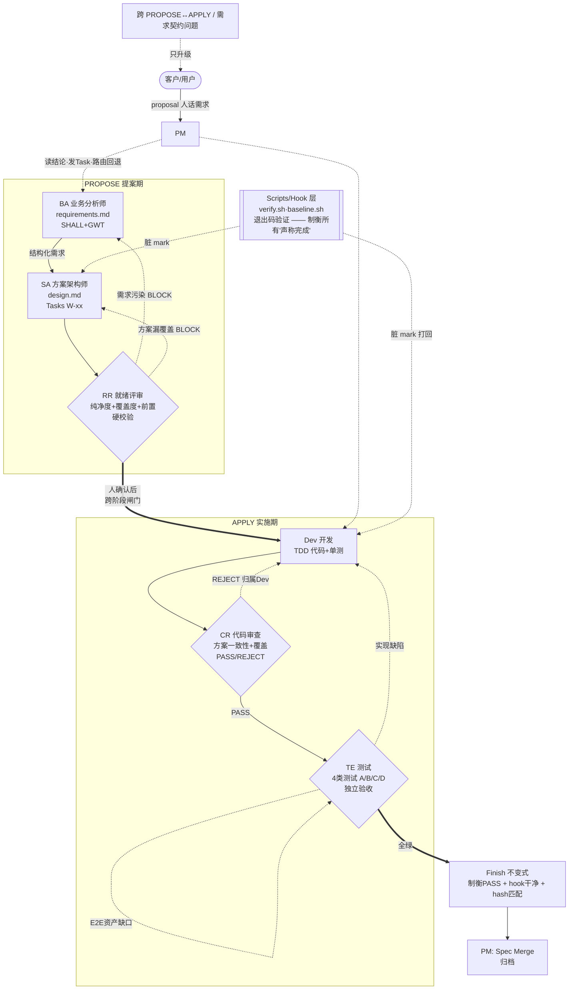
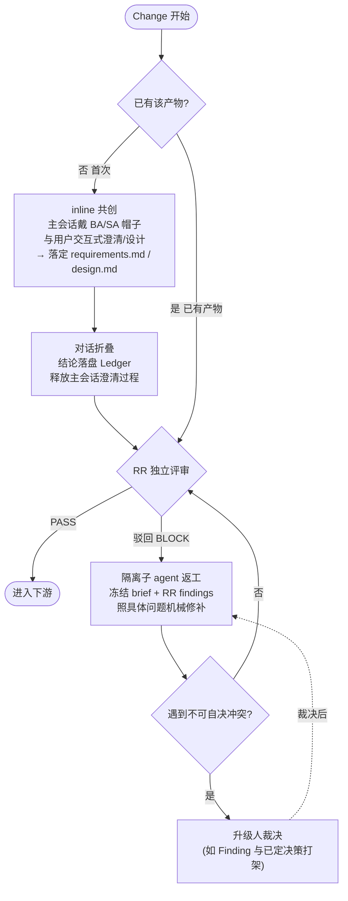

# RockSpec 重构方案：PM 编排 + 对抗式配对 + 确定性 Hook

> 日期：2026-08-27
> 性质：架构重构提案，不考虑向后兼容，必要时完全重写
> 一句话：把「引擎状态机硬门禁」换成「PM 纯编排 + 制衡 agent 对抗式裁决 + hook 确定性检测」，
> 质量不再靠引擎「不让你过」，而靠「制衡的独立裁决 + hook 的机器铁证」。

---

## 一、设计目标与一条不可退让的承重墙

### 目标（用户意图）
1. 去掉 engine 的硬性流程控制（18 状态机、强制序列、revision/reconcile 回环全拆）。
2. 主会话 = **PM 角色**，只控流程、调度专职 agent，不干活、不判质量。
3. 每个专职 agent：**独立上下文 + 独立产出 + 一个独立结论**。
4. 每个专职 agent 有一个**制衡 agent**（Dev↔CR），质量由制衡保证。
5. 可选放漂：给专职 agent 加 **hook**，干完活 CLI 做产出物确定性检测，不合格打 mark；制衡 agent 见 mark 直接打回重做。

### 一道必须保留的承重墙

**PM 是 LLM，可能偷懒或出 bug 而跳过制衡。** 若没有任何硬约束，「靠制衡保证质量」会退化成剧场——PM 可以不派制衡就宣布完成。因此保留**唯一一道**引擎级不变式（替代原来的 18 道门）：

> **Finish 不变式**：一个 Change 允许进入「交付」，当且仅当每个工作产物都满足
> `{ 制衡 agent 的 PASS 裁决存在 + 该产物全部 hook mark 干净 + 制衡裁决绑定的产物 hash == 当前 hash }`。

引擎**不再管顺序**（先需求还是先设计全归 PM），只守这一条：**没经过制衡、没过 hook 的东西不能被当成 done**。这是「1 道终点不变式」代替「18 道过程门」，守的是「配对确实发生了」而非「状态序列」。

> 若要连这道门也拆（纯放漂），质量即变成完全押在 PM 自律上的「尽力而为」。**建议保留**——它是整套对抗结构成立的地基。

---

## 二、角色拓扑：真实开发团队（张乐老师 Harness Engineering 模型）

原则修正：**不造影子角色**。制衡不是给每个作者配一个「Critic」影子，而是靠真实团队里**本就存在、且与生产者有天然职责张力**的角色。采用张乐老师的 7 角色 + 两阶段模型。

### 两阶段边界（关键）

流程分为两个阶段，**跨阶段边界的问题只能升级给人**，不能自动回退：

- **PROPOSE（提案期）**：BA → SA → RR。产出需求、方案、就绪校验。RR 通过 + **人确认**后才进入 apply。
- **APPLY（实施期）**：Dev → CR → TE。产出代码、审查、测试验收。

### 7 个真实角色

| 角色 | 阶段 | 现实对应 | 核心职责 | 硬禁止 |
|---|---|---|---|---|
| **PM** | 全程 | 项目经理 / Scrum Master | 读结论 → 发 Task → 处理回退 → Spec Merge → 更新看板 | 不写需求、不定方案、不给技术建议、不评价代码质量、不替他人做专业判断 |
| **BA** | PROPOSE | 业务分析师 | 把 proposal 的「人话」翻译成 SHALL + GWT 可测试需求（requirements.md） | 禁写文件路径、框架名、DB 细节、路由/组件名——实现层全归 SA |
| **SA** | PROPOSE | 方案架构师 | 把结构化需求翻译成技术方案 + 拆 Task（design.md，W-xx 编号，每条标注覆盖的 R/S） | 需求夹带实现层内容 → BLOCK 打回 BA |
| **RR** | PROPOSE 出口 | 就绪评审员 | 进开发前最后一道硬校验：需求纯净度 + 方案覆盖度 + 前置条件 | —（是制衡者，见矩阵） |
| **Dev** | APPLY | 开发工程师 | 按 Tasks 强制 TDD 实现（写测试FAIL→实现PASS→重构→build-test→post-verify） | — |
| **CR** | APPLY | 代码审查员 | 执行 code-review 9 步，给 PASS/REJECT + 问题归属 + PM 路由 | 不允许自行改代码，只能 REJECT |
| **TE** | APPLY 出口 | 测试工程师 | 交付链最终验收，4 类测试全覆盖（A-API/B-真实浏览器/C-回归/D-工程） | —（是制衡者，见矩阵） |

> 每个角色 = 一个独立上下文的专职 agent。「同岗第二人」（如 CR 是另一位 Dev、RR 是资深 BA/SA）由**独立实例**扮演，互不可见——制衡的本质是「独立的第二个人」，不是新工种。

### 角色制衡矩阵（谁制衡谁）

| 被制衡者 | 制衡者 | 制衡机制 | 对应本方案的层 |
|---|---|---|---|
| BA（需求夹带实现层） | **RR** | 纯净度检查：出现实现细节 → 摘录原文 BLOCK 打回 | 语义制衡 |
| SA（方案遗漏需求） | **RR** | 覆盖度检查：design 未覆盖所有 R/S → BLOCK | 语义制衡 |
| Dev（代码偏离方案） | **CR** | 方案一致性 + 需求覆盖矩阵 | 语义制衡 |
| Dev（测试不充分） | **TE** | 4 类测试独立执行，B 类真实浏览器 | 语义制衡 |
| CR（审查遗漏） | **TE** | TE 不看 CR 结论，独立验证（双重制衡） | 语义制衡 |
| **所有角色（声称完成）** | **Scripts** | verify.sh / baseline.sh / Hook 以**退出码**验证 | **确定性 Hook 层（第四节）** |
| **PM（可能越权）** | **Rule** | workflow-discipline 约束 PM 只做调度 | **承重墙 + PM 铁律（第一/三节）** |

**这张矩阵与本方案的三层分工精确对应**：
- 前 5 行是 **LLM 语义制衡**（RR/CR/TE 的判断）——机器判不了的内容质量。
- `Scripts` 行 = 本方案的 **Hook 确定性层**：任何角色声称「完成」都要过退出码，骗不过。
- `Rule` 行 = 本方案的 **承重墙 + PM 三铁律**：防 PM 越权/跳过制衡。

### PM 的回退路由规则（张乐老师模型的精髓）

PM 处理打回时，**按问题归属和阶段边界路由**：

- **PROPOSE 内**：可在 BA↔SA↔RR 间打回（如 RR 发现需求污染 → 回 BA；方案漏覆盖 → 回 SA）。
- **APPLY 内**：按问题归属路由——`Dev-owned` 回 Dev，`TE-owned`（E2E 资产缺口）回 TE，`Upstream-contract`（需求/契约问题）回 SA/BA 或升级人。
- **跨 PROPOSE↔APPLY 边界**：**只能升级给人**，不能自动跨界回退。

> 这条「跨阶段边界只升级、不自动回退」的规则，替代了原引擎复杂的 revision/reconcile 回环——阶段内打回简单直接，跨阶段交给人判断。

### 协作闭环全景



**图注**：实线 = 正向流转；虚线 = 制衡打回；粗线（==>）= 需人确认的跨阶段闸门。Hook 层横切所有角色，任何「声称完成」都要过退出码。PM 全程在旁调度（读结论、发 Task、路由回退），不进入任何产物的生产或评审。

---

## 三、PM（主会话）的控制模型

PM 是一个**极小上下文的路由器**。它唯一的状态是一张**工作清单（Worklist）**，每项形如：

```
{ artifact_id, maker_role, checker_role, status: pending|making|checking|passed|blocked, verdict_ref }
```

### PM 控制循环（伪代码）

```
loop:
  ledger = cli.status(--view worklist)        # 从 Ledger 拉当前全景，PM 不靠记忆
  item = pick_next_actionable(ledger)         # 无依赖阻塞的下一项；顺序由 PM 判断，非引擎强制
  if none:
    if all_passed and finish_invariant_ok(ledger):
        present_disposition_to_user()          # 交付处置交给人
    else:
        surface_blockers_to_user()
    break

  switch item.status:
    pending  ->                                # 首次生产：按角色选调度模式
       if item.role in {BA, SA} and no_prior_artifact(item):
           inline_cocreate(item.role)          # ★ 主会话戴上角色帽子，与用户交互式共创
       else:
           dispatch(maker) as fresh subagent   # Dev 等执行型：隔离子 agent
    made     -> dispatch(checker) as fresh subagent, 独立上下文, 冻结产物快照
    blocked  ->                                # 被 RR/CR/TE 驳回：走隔离返工
       dispatch(maker) as fresh subagent, 冻结 brief + checker findings + hook marks
       # 返工中若遇不可自决的冲突 -> maker 结论 blockers 非空 -> PM 升级给人
    passed   -> mark done, continue

  # PM 从不亲自读产物全文、从不自己判质量、从不改代码
```

### PM 的三条铁律
1. **不干活**：不写代码、不做评审、不判质量。**例外**：BA/SA 的 inline 共创阶段，主会话是「戴着角色帽子」在**引导用户**产出需求/设计——这不是 PM 自己拍板，而是把用户的意图澄清成产物（决策权始终在用户，PM/角色只负责追问与落定）。
2. **不判质量**：质量结论只来自制衡者（RR/CR/TE），PM 只读 `verdict`。inline 共创的产物**照样要过 RR 独立评审**——共创不豁免制衡。
3. **不留大上下文**：一切状态从 `cli.status` 拉取（Ledger 是唯一事实源）。inline 共创的对话在产物落定后**折叠**（见下），主会话只保留 Worklist 骨架 + 待人决策项。这直接根除「压缩触发手写 handoff」。

### 顺序哪去了？
原引擎的「需求→设计→计划→实现」强制序列**下放为 PM 的依赖判断**。Ledger 只记录产物间的 `depends_on`（如 design 依赖 approved requirements），PM 据此选下一项，但**不存在引擎级状态机**阻止 PM 先探设计再回填需求。灵活性回到 PM 手里。

---

## 三之补：inline 共创 vs 隔离执行（保留交互式澄清能力）

这是本方案最关键的一处设计——**不把「生产」和「对话」绑死在隔离子 agent 上**。现实团队里 BA 跟客户澄清需求是**当面聊**的，不是躲进小黑屋写完甩文档。因此按「生产的性质」区分调度模式：

### 三种生产性质，三种调度

| 生产性质 | 角色/场景 | 调度模式 | 为什么 |
|---|---|---|---|
| **共创型** | BA 需求澄清、SA 方案设计（**首次，无既有产物**）| **inline** —— 主会话戴角色帽子与用户交互 | 方向未定，需要与用户一句来一句去地追问、澄清、拍板开放决策 |
| **执行型** | Dev 写代码 | **隔离子 agent** | 照已定死的合同执行，不需要与用户实时聊 |
| **制衡型** | RR / CR / TE | **隔离子 agent** | 评审要独立才客观，绝不能与被评审者或用户共处一个上下文 |

### 首次 vs 返工：BA/SA 的模式切换（你要的核心细化）

同一个 BA/SA 角色，在**首次生产**和**被驳回返工**时走不同模式：



**逻辑要点**：
- **首次无产物** → BA/SA 走 inline，与用户共创。这是你最看重、原方案丢失、现在找回的交互式澄清/设计能力。
- **已有产物被 RR 驳回** → 走**隔离子 agent 返工**。因为方向已在首次共创时定了，返工只是照 RR 的具体 Finding 修补，属机械执行，不必再占用用户和主会话。
- **返工遇不可自决冲突**（如 RR 要改的东西与另一条已定决策/需求矛盾，BA/SA 无权单方裁定）→ 子 agent 在结论 `blockers` 里标出，PM **升级给用户裁决**，不硬改。
- 无论首次还是返工，产物**都要过 RR 独立评审**——共创不豁免制衡。

### 对话折叠机制（你采纳的点）

inline 共创天然会把「澄清对话」留在主会话，若累积会重蹈 6 窗口覆辙。因此：

1. 共创进行时：对话 inline，你一句 AI 一句，正常交互。
2. 产物落定时：requirements.md / design.md 落盘 Ledger（带 hash）。
3. **落定即折叠**：主会话丢弃澄清过程的细节，只保留一条骨架记录 `{artifact_id, status: made, output_hash, "已与用户共创澄清，见产物"}`。
4. 后续若需回看：从 Ledger 读产物，而非翻主会话历史。

**效果**：享受了 inline 交互的连续性，又不让澄清对话长期占用上下文——「聊的时候在场，聊完把结论沉淀、过程释放」。

---

## 四、Hook + Mark：确定性检测层（硬地板）

这是「放漂」的关键，也是解决「质量门时序倒挂」的核心：**机器可判定的错误在产出的当下当场拦截**，不留到末端。

### 机制
1. 每个专职 agent 干完活，其 hook **自动触发** `rockspec check <artifact_id>`。
2. CLI 跑该产物类型的**确定性检测集**（纯机器规则，无 LLM）：
   - **通用**：schema/frontmatter 合法性（复用现有 `validationIssue` 候选值提示）、必填章节存在、hash 可计算。
   - **Requirements**：每个 Requirement 有 Scenario、无 TODO 占位。
   - **Design**：全局约束/方案比较/未解决风险章节齐全、每个决策的实现小节完整、决策覆盖所有需求。
   - **Plan/Task**：任务 DAG 无环、`validation_commands` 非空、依赖闭合。
   - **Dev**：`validation_commands` 有绑定当前 commit 的成功证据（exit=0）、被删符号不出现在导出签名、测试文件在被编译路径内、无未提交产物。
   - **Acceptance**：每个 Scenario 有可执行证据映射。
3. 检测结果写成 **mark**：`{ artifact_id, hash, checks: [{id, status: pass|fail, detail}], marked_at }`，存入 Ledger。
4. **失败即打 mark 为脏**，不阻止 agent 结束（agent 已交活），但下游 制衡者见脏 mark **必打回**。

### 为什么这一层能解掉历史痛点
- **时序倒挂**：validator 依赖泄漏、测试没被编译这类**可判定规则**，在 Dev 产出当下就被 hook 抓到打脏，不会漏到 Final CR。
- **schema 往返**：hook 在提交前就跑 schema 检测并给候选值提示，agent 当场改，不进 PM 上下文往返。
- **省 制衡者成本**：制衡者见脏 mark 直接打回，不启动语义评审。

### Hook 的边界（诚实说明）
Hook 只能查**机器可判定**的东西。「设计合不合理」「代码真满足意图吗」hook 判不了——那是 制衡者的语义评审职责。**hook 是地板不是天花板**：它保证「机械错误一个不漏」，但不保证「判断质量」。

---

## 五、结论协议：专职 agent 的「一个独立结论」

每个 agent（生产者或制衡者）结束时产出**恰好一个结构化结论**，这是 PM 唯一消费的东西。

> 下文用「生产者 / 制衡者」作为通用关系词，具体到岗位就是第二节的 7 角色：生产者 = BA/SA/Dev，制衡者 = RR（就绪评审）/ CR（代码审查）/ TE（测试）。

### 生产者结论（以 SA 写设计为例）
```yaml
role: sa                # 真实岗位：ba | sa | dev
artifact_id: design
output_path: .rockspec/changes/<id>/design.md
output_hash: sha256:...
self_report: "完成 3 个决策，覆盖 R-001..R-005，无开放决策"
blockers: []          # 若有无法自决的产品决策，列在这里 → PM 抛给人
```

### 制衡者结论（以 CR 审查 / TE 测试 / RR 就绪为例）
```yaml
role: cr                # 制衡角色：rr | cr | te
subject_hash: sha256:...        # 必须 == 生产者的 output_hash，否则拒绝登记
hook_marks_seen: clean|dirty
verdict: PASS | REJECT           # RR/TE 用 BLOCK/FAIL，语义同 REJECT
problem_owner: dev              # 问题归属：dev | te | upstream-contract —— PM 据此路由
findings:                        # 非 PASS 必须至少一条
  - id: F-001
    severity: critical|important|minor
    evidence: "src/foo.ts:42 偏离 design W-03"
    route_to: dev                 # 打回给谁（对应生产者角色）
```

### 关键约束
- 制衡者的 `subject_hash` 必须匹配当前产物 hash（对应第一节承重墙的第三个条件），**防「评审了旧版本」**。这是那次会话「reviewer 拿错包路径假 PASS」的根治。
- `verdict != PASS` 必须带 finding；`PASS` 不得有 open critical/important。
- PM 只读 `verdict` 和 `blockers`，不读 findings 全文（findings 留给被打回的生产者看）。

---

## 六、Ledger：Engine 的降级形态

原 Engine（291KB 状态机）**完全重写**为一个轻量 **Ledger**（账本），职责收缩到三件事：

1. **记录**：Worklist、产物 hash、hook marks、制衡者verdicts、执行记录。仅追加，不做状态机推进。
2. **投影**：`status --view worklist`（PM 用）、`--view resume`（跨压缩续接）、`check <artifact>`（hook 用）。
3. **守一道门**：`finish` 时校验第一节的 Finish 不变式。仅此一处「硬控」。

**丢弃**：18 状态机、WORKFLOW_PRIMARY_ACTIONS、审批门序列、revision/reconcile 回环、profile 自动升级、STALE 状态联动。

**保留（以更轻形态）**：hash 绑定（防篡改）、evidence 记录、context-package 隔离、artifact schema 校验（移入 hook）。

### Ledger 不做状态机后，「回环」怎么办？
原来的 revision/reconcile 是为了「后期发现问题时受控回退到上游」。新架构下这**天然消失**——因为没有强制序列：制衡者打回 生产者就是「回退」，PM 重新 dispatch 对应 生产者即可，不需要状态机记录「从 FINAL_REVIEW 跳回 SCOPING」这种复杂迁移。**打回 = 把 Worklist 项的 status 从 checking 改回 pending，附 findings。** 就这么简单。

---

## 七、放漂三级光谱

你的方案天然支持「按需放漂」，明确分三级，用户按模型能力和风险选：

| 级别 | 配置 | 适用 |
|---|---|---|
| **L1 全对抗 + hook** | RR/CR/TE 全部启用，hook 全开，Finish 不变式强制 | 高风险、弱模型、需审计 |
| **L2 关键对抗 + hook** | 只保留 CR + TE（APPLY 期对抗），PROPOSE 期只跑 hook 不配 RR 语义评审 | 中等风险、中等模型 |
| **L3 纯 hook 放漂** | 不配语义制衡者，只有 hook 机器检测；PM 采信 hook 干净就过 | 强模型、快速迭代、信任判断 |

> 对照 Comet 的实证数据（Native 对 Classic：token -76.8%、质量不降），**L3 就是 RockSpec 版的「Native 模式」**。这套架构让「付多少治理税」成为用户的显式选择，而非一刀切。

---

## 八、模型 Tier 的硬约束（补现有空档）

现状缺陷：`model_tier` 在引擎里只是 execution 的 optional 记录字段，**不强制**——「用足够强的模型做关键判断」全靠 agent 自觉。

新架构补上：**制衡者（RR/CR/TE）的 dispatch 强制声明 model tier，Ledger 校验其不低于该角色的 minimum**。理由：制衡的质量直接取决于制衡者的判断力，让弱模型当 CR/TE 等于让对抗结构空转。这是「屏蔽模型差异」能真正往上再走一层的关键——把「关键判断用强模型」从建议变成 Ledger 门禁（属于 Finish 不变式的延伸，不算恢复状态机）。

---

## 九、与现有资产的取舍

### 完全重写
- `packages/engine`：291KB 状态机 → 轻量 Ledger（记录+投影+一道门）。
- `packages/protocol/schemas.ts`：保留 artifact schema，删状态机/revision/gate 相关。
- `workflow.ts`：删（状态机、recoveryDirective、approval gates 全部消失）。

### 新建
- **Hook 运行时**：`rockspec check <artifact>` + 各产物类型的确定性检测集（很多可从现有 `assertDesignStructure`、`validation_commands` 证据门、`validationIssue` 迁移复用）。
- **PM 编排 skill**：主会话的控制循环 + dispatch 协议 + Worklist 管理。
- **角色 prompts**：7 个真实角色（PM/BA/SA/RR/Dev/CR/TE），两阶段边界，通用制衡协议。
- **结论 schema**：生产者结论 + 制衡者结论。

### 保留复用
- context-package 隔离机制（子 agent 独立上下文，已验证可用）。
- hash 绑定 / evidence 记录基础设施。
- schema 候选值报错（刚补的第 1 项，直接进 hook 层）。
- worktree 隔离。

---

## 十、诚实的风险与边界

1. **PM 是新的单点风险**：质量结构依赖 PM 忠实 dispatch。承重墙（Finish 不变式）挡住「PM 跳过制衡者」，但挡不住「PM 派了个敷衍的 dispatch brief」。缓解：生产者/制衡者的 brief 由 Ledger 冻结投影生成，不由 PM 手写。
2. **inline 共创会占用主会话上下文**：BA/SA 首次共创在主会话进行，澄清越充分对话越长。缓解靠「对话折叠」（产物落定即释放过程），但折叠时机若没把握好，仍可能在一次长澄清里逼近压缩。且 inline 共创的产物由主会话产出、又要回主会话调度 RR——需确保 RR 是**真正独立的隔离实例**，不复用主会话已有的共创上下文，否则制衡的独立性被污染。这是「找回交互能力」付出的代价，属可控但需实现时警惕。
3. **制衡者仍是 LLM，仍可能漏判**：对抗配对降低但不消除「判断质量」风险。Strict 双制衡者是唯一进一步缓解，代价翻倍。**这是所有 LLM 评审方案的共同天花板，不是本方案独有短板。**
4. **Hook 覆盖面决定放漂安全度**：L3 纯放漂的安全性完全取决于 hook 检测集的完备度。hook 漏检的机器规则 = 放漂的风险敞口。需要持续扩充 hook 规则，且建议接入 eval（见下）。
5. **失去审计序列**：去掉状态机后，「这个 change 走过哪些步、每步谁批的」这种完整审计链会弱化。若合规场景强需要，需在 Ledger 的追加日志里补事件流（比状态机轻，但要显式设计）。

---

## 十一、建议的落地路径（分阶段，每阶段可独立验证）

1. **P0 — Ledger 骨架 + Worklist 投影**：先把 Engine 降级成「只记录+投影」，砍掉状态机推进逻辑，保留 hash/evidence。产出 `status --view worklist`。
2. **P1 — Hook 层**：实现 `rockspec check`，迁移现有确定性检测（schema、design 结构、validation 证据）为 hook 规则，产出 mark。
3. **P2 — 生产—制衡配对 + 结论协议**：实现 5 个岗位 + 评审变体 prompt、结论 schema、subject_hash 校验。
4. **P3 — PM 编排 skill**：控制循环、dispatch、打回，**含 inline 共创 vs 隔离返工的双模式切换**（首次 BA/SA 走 inline、被驳回走隔离子 agent、冲突升级人）+ 对话折叠。
5. **P4 — Finish 不变式**：唯一那道门。至此 L1 可跑通。
6. **P5 — 放漂分级 + model tier 门**：L2/L3 配置，制衡者tier 强制。
7. **P6（可选）— eval 接入**：借鉴 Comet，用 Rubric/Pass@k 度量各档质量，**用数据验证「放漂到哪一级仍安全」**，把质量论断从定性变定量。

---

## 十二、一句话总结

> **引擎从「18 道过程门」退成「1 道终点不变式」；顺序交给 PM，机械质量交给 hook（当场拦），语义质量交给对抗配对（必要时才贵），关键判断强制用强模型。**
> 这既满足「去 engine 硬控、PM 编排、对抗制衡、hook 放漂」的全部意图，又用唯一那道承重墙防止对抗结构退化成剧场。放漂三级让「治理税」成为用户按模型和风险的显式选择——这正是 Comet 数据所指向的方向。
