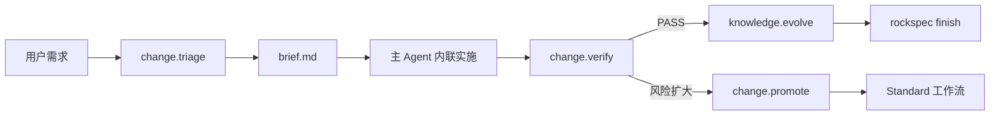

# RockSpec Harness Engineering 技术方案

> 文档状态：Draft v0.15
> 目标读者：RockSpec 设计者、实现者和工作流维护者  
> 本文用于整体方案评审，不代表所有细节已经冻结。

## 已确认决策

1. RockSpec 建设为独立工程，不依赖 OpenSpec、Superpowers 或 Matt Skills 运行。
2. 外部项目研究不纳入首版本地工程；未来可根据需要选择合适的分析和研究形式。
3. RockSpec 用户侧 Skill 使用 `rockspec-<能力>` 命名；`rockspec-change` 是完整流程编排入口，Requirements、Design、Plan、Implement、Review、Acceptance 等能力也作为可直接调用的 Skill；细粒度状态迁移仍使用内部 Action ID；BA、SA、DEV、CR、TE 仅作为内部责任配置；外部 Skill 保留原名。
4. 首版同时支持 Codex 和 Claude Code，共用 Protocol、Engine 和 Canonical Skills。
5. Standard 实施阶段使用 Task Implementer + Task Reviewer 的轻量双 Agent 循环。
6. Acceptance Validation 完成后再执行整体 Delivery Review，即 TE 后 Final CR。
7. Lite、Standard、Strict 使用同一状态机；Lite 发现风险后只能向上升级。
8. Standard 固定保留三个用户批准点，每一步完成后必须给出下一步执行建议。
9. Strict 的 Requirements、Readiness、Task 和 Delivery Review 均使用两个独立 Reviewer。
10. Spec 结构和行为关键字强制使用英文。
11. 每个 Task 对应且仅对应一个最终 Commit。
12. TE 新增的测试资产不单独执行 Task Review，统一交给 Final CR。
13. 首版收尾保持代码托管平台无关，不强制绑定 GitHub PR。
14. 首版每个 Git 仓库只允许一个位于仓库根目录的 `.rockspec/` Root。
15. RockSpec 保持运行时和代码所有权独立，但必须用参考设计内化矩阵记录外部机制的保留、改造、重实现和舍弃情况。
16. Skill 采用“可组合能力 Skill + 内部 Action + Capability Provider”三层模型；首个外部 Provider 为 `ui-ux-pro-max`，用于 UI 原型、实施上下文和 UI 质量审查。
17. 每个能力 Skill 直接拥有自己的 Action、Role Prompt 和产物模板，不依赖仓库顶层重复目录；完整 Skill 目录可以单独复制和检查。
18. 首版 Canonical Skill 的触发描述、正文、展示元数据、Action 说明、Role Prompt 和产物模板统一使用中文；Skill 名、Action ID、CLI 命令、Schema 字段、Verdict 及 Spec 强制关键字保持英文。
19. 首版使用 `rockspec-worktree` 支持 Change 级并行隔离；一个 Active Change 绑定一个工作区，同一 Change 内 Task 仍默认串行。项目内 Skill 和配置由 Git 继承，用户不在新 Worktree 中重新初始化，也不手动执行 `rockspec new`。
20. Task 实施固定 Task Base、冻结 Brief、`allowed_paths`、单 Commit 和实际执行证据；Task/Delivery Review 只审 Engine 生成的固定 Review Package，并用结构化 Frontmatter 绑定 Reviewer execution、Review Subject、轮次和 Findings。
21. Design 和 Plan 的 R/S 覆盖、Task DAG、跨 Task 接口依赖由 Engine 确定性校验；不为 Design 新增 Reviewer。
22. 首版提供 npm 一键安装器：项目内安装 Canonical Skills、自包含 Runtime、双宿主适配和安装 Lock；外部 Skill 不进入 npm 包，只能从用户明确提供或本机发现的可信来源复制，未知 License 必须显式确认。
23. Research、Requirements 和 Design 采用 Inline 作者 + Interactive 在线协作：主会话逐问、比较方案、逐章节确认后才写最终产物；Plan 继续 Inline 一次生成。会话确认不替代 Reviewer 或绑定 Hash 的正式审批。
24. 跨阶段内容变化使用 Intent Envelope + Reconciliation Loop：首次 Spec、Design、Implementation Gate 始终由用户批准；只修复一致性、下游派生或既定实现且不改变 Authority Baseline 的 Revision 可由独立 Reviewer 自动续期既有 Gate；意图/决策/风险变化、Critical、边界未知、Reviewer 分歧或两轮未收敛必须返回用户。实施后 Revision 仍须绑定 non-PASS Review/Open Finding，并保留 Completed Task 和活动 Attempt。

## 当前实现状态

| 范围 | 状态 | 说明 |
|---|---|---|
| Protocol、Engine、CLI | 已实现 MVP | 本地单元和集成测试覆盖状态机、审批失效、Design/Task 追踪、DAG、Review、Evidence、Worktree 和 Archive 主路径 |
| Canonical Skills 与 Action/Recipe | 已实现静态契约 | Action/Recipe YAML 是可阅读的 Agent 指引；Engine 行为以 `packages/engine/src/workflow.ts` 和 `packages/engine/src/engine.ts` 为准，并由一致性测试防漂移 |
| Codex / Claude Code | 已完成双宿主设计和静态 Manifest/Adapter 校验 | 两个真实宿主中的安装、发现、Subagent 派发和恢复对等性仍是发布前工作，不宣称已完成 Live Host Parity |
| 一键安装器 | 已实现并通过隔离安装测试 | 支持引导式/非交互安装、双宿主、外部 Skill 本地来源、事务回滚、Lock、Doctor、Repair、Upgrade 和保守卸载；尚未发布 npm 包 |
| `ui-ux-pro-max` | 已完成 Installed Provider 契约 | 不进入 RockSpec npm 包；可由安装器从用户可信本地来源复制到项目，License 仍为 `UNKNOWN`，必须显式确认 |
| Profile 复杂度校准 | 协议已定义，数据待采集 | 必须基于 3 至 5 个真实 Change 的归档数据后再提出首轮裁剪建议 |

## 目录

- 1-3：背景、目标和核心原则
- 4-6：总体架构、标准工作流和自适应降级
- 7-8：Skill 设计和内部责任配置
- 9-11：产物、追踪协议和 Gate
- 12-14：多 Agent 实施、TE/Final CR 顺序和双宿主适配
- 15-17：CLI、Git 收尾和参考设计内化
- 18-21：工程结构、测试评测、实施阶段和 MVP 标准
- 22：已确认评审决策

## 1. 背景

OpenSpec、Superpowers、Matt Skills 等项目分别在 Spec 管理、需求与设计脑暴、实施计划、TDD、多 Agent 协作和代码审查方面提供了有价值的实践，但它们的流程边界、产物格式和执行成本并不完全一致。

RockSpec 的目标不是将这些项目作为运行时依赖拼装起来，而是建设一套独立、可验证、可持续演进的 Harness Engineering 研发工作流：

- RockSpec 独立定义协议、状态机、产物、Skills 和 CLI。
- 首期支持 Codex 与 Claude Code 两个多 Agent 宿主。
- 外部项目可作为未来研究对象，但具体分析方式不属于当前本地工程方案。
- 工作流既能服务完整功能研发，也能合理处理按钮文案修改等轻量需求。

## 2. 目标与非目标

### 2.1 目标

1. 建立从需求澄清到归档的完整研发闭环。
2. 使用 BDD Spec 作为可测试的业务契约。
3. 使用 Design 和 Plan 将需求落实为可执行方案。
4. 为每个实施任务生成独立、聚焦的 Agent 上下文。
5. 使用轻量 Dev + CR 协作保证单任务质量。
6. 由独立验收测试流程补充集成测试和 E2E 测试。
7. 将整体 Final CR 固定在 TE 验收之后，审查最终分支。
8. 使用确定性脚本和状态机约束 Agent 的完成声明。
9. 同一套核心协议同时适配 Codex 和 Claude Code。
10. 根据变更风险提供 Lite、Standard、Strict 三档流程。
11. 对参考项目的优秀机制建立可追溯的内化与清洗对照。
12. 使用稳定、可组合的能力 Skill 和 Capability Provider 接入 Requirements、Design、Debug、Skill 创建、原型及其他领域能力；每个 Skill 可以独立产生有用结果，但不把每个状态迁移动作都复制为 Skill。
13. 多个需求通过 Change 级 Worktree 独立推进，并让所有 Worker、Reviewer 和 TE 固定使用 Change 绑定的工作目录。

### 2.2 非目标

1. 首版不兼容 OpenSpec 的目录或命令协议。
2. 首版不要求安装 OpenSpec、Superpowers 或 Matt Skills。
3. 首版不建设图形化项目管理平台。
4. 首版不并行同一 Change 内的 Task，也不自动合并多个 Change。
5. 首版不替代 GitHub、GitLab 等代码托管和 PR 平台。
6. 首版不允许 AI 绕过人工批准直接合并或推送代码。
7. 首版不建设本地源码获取、上游 Diff 或外部项目分析系统。

## 3. 核心原则

### 3.1 独立协议

RockSpec 的工作流状态、文件格式和角色约束由自身定义，不受任何参考项目版本影响。

### 3.2 可组合能力 Skill 与内部 Action

用户侧 Skill 按用户希望完成的能力结果命名。`rockspec-change` 负责完整流程编排；`rockspec-requirements`、`rockspec-design`、`rockspec-plan`、`rockspec-implement`、`rockspec-review`、`rockspec-acceptance` 等 Skill 可以直接调用，从已有 PRD、Design、Plan、Diff 或验收目标开始工作。

Skill 的“原子性”是能力原子性：一次调用产生一个独立、可检查、可复用的结果。Engine 的“原子性”是状态迁移原子性：`requirements.clarify`、`requirements.review`、`design.technical`、`task.execute` 等 Action 仍是内部协议。两者不要求一一对应，一个能力 Skill 可以在 Attached 模式下负责一组内聚 Action，也可以在 Standalone 模式下完全不迁移状态。

外部 Skill 保留原始名称，由 Capability Provider 映射到工作流需要的能力。BA、SA、DEV、CR、TE 等角色只作为 Subagent 的内部责任配置存在。

### 3.3 Evidence before Claims

Agent 不能仅凭推理或子 Agent 报告声明任务完成。每个 Gate 必须读取新鲜的命令输出、Diff、测试结果或审批记录。

### 3.4 单一状态写入者

只有 RockSpec Engine/CLI 可以迁移状态。Skill 和 Subagent 只能提交产物与结论，不能直接修改工作流状态。

### 3.5 审批绑定内容

审批必须绑定被审查产物的内容 Hash。前置产物发生实质变化后，下游审批自动失效。

### 3.6 渐进式严谨

轻量需求减少文档、Agent 和人工确认，但不能减少范围检查、验证证据和自动升级能力。

## 4. 总体架构

```text
┌─────────────────────────────────────────────┐
│ Host Adapters                               │
│ Codex / Claude Code                         │
├─────────────────────────────────────────────┤
│ Composable Capability Skills                │
│ change / requirements / design / review ... │
├─────────────────────────────────────────────┤
│ Workflow Recipes / Capability Providers     │
│ Engine Actions / External Skills            │
├─────────────────────────────────────────────┤
│ RockSpec Engine                             │
│ State / Gate / Dispatch / Routing / Lock    │
├─────────────────────────────────────────────┤
│ RockSpec Protocol                           │
│ Artifact Schema / IDs / Reviews / Evidence  │
├─────────────────────────────────────────────┤
│ Git-native Storage                          │
│ Markdown / YAML / NDJSON / Git              │
└─────────────────────────────────────────────┘
```

### 4.1 Protocol

定义稳定、宿主无关的数据契约：

- Change、Artifact、Approval、Task、Review、Finding、Evidence 数据结构。
- Requirement、Scenario、Decision、Task、Test 等 ID 规则。
- 状态和状态迁移规则。
- Spec Delta 和 Archive 规则。
- 各类 Markdown 模板及其机器可解析部分。

### 4.2 Engine

负责确定性工作流控制：

- 计算当前状态和允许动作。
- 执行 Gate 校验。
- 创建和更新任务状态。
- 管理审批 Hash 和失效传播。
- 登记 Agent execution ID。
- 处理问题回退和责任路由。
- 对状态文件进行加锁和原子写入。

### 4.3 CLI

为 Skill、用户和 CI 提供统一入口。CLI 输出应支持人类文本和稳定 JSON 两种模式。

### 4.4 Capability Skills 与 Workflow Recipes

Capability Skill 是可独立调用的用户入口，负责完成一个清晰结果并与 Engine 契约衔接。`rockspec-change` 是薄编排器：它读取 Engine 返回的 `recommended_next.entry_skill` 并调用相应能力 Skill，不重复实现 Requirements、Design、Plan、实施或审查逻辑。Workflow Recipe 描述完整流程的组合顺序，但不直接实现状态判断和格式校验。

每个能力 Skill 支持两种模式：

- Attached：附着到合法状态的 RockSpec Change，只能通过 Engine/CLI 提交产物、结论和 Gate。
- Standalone：直接消费外部 PRD、Design、Plan、Diff 或验收目标，产物写入 `.rockspec/workbench/<capability>/<slug>/`，不得声称获得 RockSpec 审批或完成完整 Change。

作者执行位置和用户协作方式是两个正交维度：

```yaml
executor:
  mode: inline
  collaboration:
    mode: interactive
```

- `inline` 表示 Research、Requirements 或 Design 由当前主会话作者完成，不为写作本身创建 Subagent。
- `interactive` 表示问题、方案和章节必须在会话中逐步确认；每个确认点都是回复边界，用户确认前不得写最终阶段产物、完成 Action、启动 Reviewer 或进入下一能力。
- `rockspec-plan` 保持 `inline` 且非 Interactive：它消费已经批准的 Requirements 和 Design，直接生成可确定性校验的 Task DAG，再由 Readiness Reviewer 评审。

三项交互能力共用同一骨架，但确认对象不同：

```text
静默读取上下文
→ 一次一个关键问题
→ 提出 1-3 个真实方案和推荐
→ 等待用户选择
→ 逐章节展示、确认和纠偏
→ 写入最终产物并自检
→ Reviewer / Hash Approval / 下一能力
```

Research 确认研究方向、证据解释和结论；Requirements 确认业务范围、规则、可观察行为及 Scenario；Design 确认技术路径、架构边界、接口、风险和验证。简单内容可以将相邻章节合并成一个短确认，但不能省略确认。`rockspec-change` 调用这三项能力后必须把控制权交还用户，不能在同一回复中自动串联 Requirements、Design 和 Plan。

### 4.5 Capability Providers

Workflow Recipe 通过稳定 Capability ID 请求领域能力，Capability Resolver 将其映射到内置或外部 Skill：

```text
ui.prototype       → ui-ux-pro-max
skill.authoring    → rockspec-create-skill
debug.systematic   → rockspec-debug
business.research  → rockspec-research
```

外部 Skill 保留原名。Provider 负责组装所需上下文和返回产物，不拥有工作流状态迁移权。

### 4.6 Host Adapters

将统一调度能力映射到 Codex 和 Claude Code：

```text
dispatch_worker(role, brief, model_tier)
resume_worker(execution_id, findings)
wait_worker(execution_id)
read_worker_result(execution_id)
get_max_concurrency()
resolve_host_model(model_tier)
resolve_capability(capability_id)
invoke_skill(skill_name, context)
```

## 5. 标准工作流

### 5.1 流程

```mermaid
flowchart LR
    A[需求探索] --> B[BDD Spec]
    B --> C{Requirements Review}
    C -->|修改| B
    C --> D[用户批准 Spec]
    D --> E[Design Draft]
    E --> P{需要 UI 原型?}
    P -->|否| F[用户批准 Design]
    P -->|是| Q[ui.prototype 原型设计]
    Q --> R[Design Reconciliation]
    R --> F
    F --> G[Plan + Task Briefs]
    G --> H{Readiness Review}
    H -->|修改| E
    H --> I[用户批准实施]
    I --> J[Execute Task + Task Review]
    J -->|逐任务循环| J
    J --> K[Acceptance Validation]
    K -->|实现缺陷| J
    K -->|测试资产缺陷| K
    K --> L[Delivery Review]
    L -->|代码缺陷| J
    L --> M[完整验证]
    M --> N[提交 / 推送 / 可选 PR 或 MR]
    N --> O[Spec Merge + Archive]
```



### 5.2 状态机

```text
SCOPING
SPEC_REVIEW
SPEC_APPROVED
DESIGNING
DESIGN_APPROVED
PLANNING
READINESS_REVIEW
READY
IMPLEMENTING
ACCEPTANCE_VALIDATING
FINAL_REVIEW
VERIFYING
READY_TO_FINISH
ARCHIVED
```

辅助状态：

- `BLOCKED`：存在无法由当前责任域解决的阻塞。
- `PAUSED`：用户主动暂停，保留可恢复现场。
- `SUPERSEDED`：变更被新的 Change 替代。

### 5.3 人工批准点

Standard 模式包含三个明确人工 Gate：

1. 用户批准 Spec：确认需求范围和可观察行为。
2. 用户批准 Design：确认技术方向和关键取舍；需要 UI 原型时，同时批准原型及其与 Design 的一致性。
3. 用户批准实施：确认 Plan、任务拆分和实施前置条件。

AI Reviewer 的 `PASS` 只是进入人工批准的前置条件，不能代替用户批准。

### 5.4 下一步执行建议

每个 Capability Skill、Workflow Recipe 和 CLI 状态变更命令完成后，都必须基于 Engine 当前状态输出唯一的首选下一步，并在存在其他合法动作时一并列出。建议至少包含：

```yaml
current_state: DESIGN_APPROVED
recommended_next:
  action: plan.create
  entry_skill: rockspec-plan
  reason: Design 已批准，可以生成实施计划和任务拆分
alternatives:
  - action: design.technical
blocked_by: []
```

- 人类输出使用简短的“下一步建议”说明。
- JSON 输出使用稳定的 `recommended_next`、`alternatives` 和 `blocked_by` 字段。
- 存在阻塞时不得建议越过 Gate，首选动作必须是解除阻塞或返回责任阶段。
- 需要用户批准时，下一步必须明确建议用户审阅和批准对应产物。

## 6. 自适应工作流与降级策略

RockSpec 不为轻量需求建立独立旁路，而是在同一个状态模型中使用不同 Workflow Profile。

### 6.1 Profile

| Profile | 适用范围 | 主要流程 |
|---|---|---|
| Lite | 局部文案、样式、小型配置、明确的窄范围修复 | Brief → 内联实施 → 聚焦验证 → 收尾 |
| Standard | 普通功能和业务行为变更 | 完整 Spec/Design/Plan/Dev/CR/TE/Final CR |
| Strict | 安全、支付、隐私、迁移、核心基础设施 | Standard + 双 Reviewer、完整回归、限制并行 |

紧急程度不等于低风险。高风险 Hotfix 不能因为紧急而进入 Lite。

### 6.2 Lite 准入条件

以下条件必须全部满足：

- 修改目标明确且局部。
- 不新增业务规则、状态或条件分支。
- 不修改公共 API、数据库、数据格式或公共契约。
- 不涉及鉴权、权限、支付、安全、隐私或合规。
- 不增加或升级依赖。
- 不涉及数据迁移、并发、缓存一致性或不可逆操作。
- 存在明确、可执行的验证方式。
- 回滚简单。

文件数和代码行数仅作为风险提示，不作为硬判定条件。

### 6.3 Lite 流程



Lite 默认不创建 Requirements Reviewer、Readiness Reviewer、Task Implementer、Task Reviewer 或 Acceptance Test Engineer Subagent。

Lite 仍必须检查：

- 最终 Diff 没有超出 Brief。
- 没有新增业务逻辑或高风险修改。
- 聚焦测试、lint、构建或 UI 验证具有新鲜证据。
- 没有无关文件进入变更。
- 文案修改同步考虑 i18n、测试选择器和无障碍名称。

### 6.4 自动升级

出现以下任一情况，必须从 Lite 升级到 Standard：

- 实际修改范围明显超过 Brief。
- 需要新增业务条件或状态。
- 需求存在多种合理解释。
- 需要修改 API、数据结构、依赖或架构。
- 无法找到可靠验证方式。
- 需要拆分多个任务。
- 聚焦测试暴露跨模块回归。
- Agent 对影响范围缺乏信心。

仅允许自动向上升级：

```text
Lite → Standard → Strict
```

Standard 降为 Lite 只允许发生在写代码之前，并需要重新运行 Triage。

### 6.5 Strict 双 Reviewer 策略

Strict 模式在 Requirements、Readiness、Task 和 Delivery Review 中均调度两个相互独立的 Reviewer：

- 两个 Reviewer 接收相同的只读审查包，但不能读取对方的报告。
- 两个 Reviewer 分别输出独立 Verdict 和 Findings。
- 父 Workflow Recipe 只负责聚合，不得替 Reviewer 静默删除 Finding。
- 只有两个 Reviewer 都为 `PASS`，对应 Review Gate 才能通过。
- 任一 Reviewer 为 `CHANGES_REQUIRED`，Gate 即不通过并合并全部 Findings。
- 任一 Reviewer 为 `BLOCKED`，Engine 按阻塞责任域路由。
- 两个报告意见冲突时，以更严格结论阻塞，并交给 Main 或用户裁决。

Standard 仍使用单 Reviewer，避免普通需求承担 Strict 的双倍审查成本。

## 7. Skill 设计

### 7.1 命名规范

RockSpec 自有用户 Skill 使用 `rockspec-<能力>`：全小写、数字和连字符，长度不超过 64 个字符。名称表达用户可直接请求的结果，不使用 BA、SA、DEV、CR、TE 等角色缩写，也不照搬 `clarify/approve/archive` 等细粒度状态迁移动词。

外部 Skill 保留原始名称，不增加 `rockspec-*` 或 `rs-*` 前缀。`rs-*` 命名不再作为正式接口使用。

Canonical Skill 的人类可读说明统一使用中文。为保证 Codex、Claude Code、CLI 和 Protocol 稳定互操作，`rockspec-*` 名称、Action ID、Profile、Verdict、Schema Key、命令参数，以及 `ADDED/MODIFIED/REMOVED/RENAMED`、`Requirement`、`Scenario`、`MUST/MUST NOT`、`GIVEN/WHEN/THEN` 等规范关键字不得翻译。

### 7.2 用户能力 Skills

| 用户 Skill | 独立结果 | 首版范围 |
|---|---|---|
| `rockspec-change` | 路由或编排完整受治理 Change | 首版核心 |
| `rockspec-triage` | 风险分级、Lite 准入和 Change Brief | 首版核心 |
| `rockspec-requirements` | 可测试的 Requirements/Scenarios 及独立评审 | 首版核心 |
| `rockspec-design` | 基于仓库事实的技术 Design | 首版核心 |
| `rockspec-prototype` | UI/UX 原型包及 Design 对账 | 首版核心 |
| `rockspec-plan` | 可实施 Task DAG 及 Readiness Review | 首版核心 |
| `rockspec-implement` | 按 Task 实施、验证和独立评审交接 | 首版核心 |
| `rockspec-review` | Task、分支或 Final CR 的独立审查 | 首版核心 |
| `rockspec-acceptance` | 独立 TE/Acceptance 结论和测试资产 | 首版核心 |
| `rockspec-evolve` | 从已验证 Change 提炼并对账可复用产品、架构和体验知识 | 首版核心 |
| `rockspec-finish` | 最终验证、分支处置和归档 | 首版核心 |
| `rockspec-debug` | 系统化调查故障，必要时转为修复 Change | 首版独立场景 |
| `rockspec-research` | 基于可追溯证据探索业务问题，决定是否进入 Requirements | 首版独立场景 |
| `rockspec-worktree` | 为并行 Change 建立、恢复和安全收尾隔离工作区 | 首版基础场景 |
| `rockspec-create-skill` | 创建、修改、验证和双宿主打包 Skill | 后续场景 |

Skill 的 `description` 必须同时描述独立结果、直接触发场景和 Engine 推荐 Action。详细 Action/Role 契约按需放在 References 中，保证把 Skill 目录单独复制到宿主时仍能看见并执行完整能力。

`rockspec-change` 不拥有其他能力的实现，只做以下工作：

1. 识别用户是否明确请求单一能力；是则直接路由。
2. 对完整或恢复中的 Change 先通过 `rockspec-worktree` 定位绑定工作区，再在该 `cwd` 调用 `rockspec status --view summary --json`；仅按调度需要读取 `tasks`、`recovery` 或 `hashes` 投影。
3. 新 Change 在 Triage 确定 ID/Profile 后先选择 current 或 Worktree，再由编排器在目标目录调用底层 `rockspec new`；用户不手动执行。
4. 按 `recommended_next.entry_skill` 调用真实 Skill，不根据记忆模拟它。
5. 每个能力返回后重新读取状态，并遵守人工审批和阻塞边界。

直接调用能力 Skill 时：

- 当前 Change 允许相应 Action，则使用 Attached 模式接入 Gate。
- 没有 Change 或当前状态不允许挂接，但用户提供了足够输入，则使用 Standalone 模式写入 `.rockspec/workbench/`。
- Standalone 产物未来可以显式导入 Change，但不得伪造历史审批或自动跳过 Gate。

### 7.3 内部 Actions 与 CLI

以下名称是 Engine Action ID，不作为同名 Skill 进入宿主列表：

```text
change.triage
change.promote
requirements.clarify
requirements.review
design.technical
design.prototype
plan.create
readiness.review
task.execute
task.review
acceptance.validate
delivery.review
change.verify
knowledge.evolve
change.archive
```

用户恢复和控制工作流使用 CLI，不再为 `start/continue/status/apply/finish` 各自创建 Skill。`rockspec new` 保留为 `rockspec-change`/`rockspec-triage` 和测试使用的底层接口，不是正常用户步骤：

```text
rockspec status
rockspec continue
rockspec revise
rockspec revise --amend
rockspec apply
rockspec knowledge package
rockspec finish
```

Engine 同时返回 `recommended_next.action` 与 `recommended_next.entry_skill`。Action 决定合法状态迁移，Entry Skill 决定由哪个用户能力承担下一步；`rockspec-change` 不在自身正文中重做该能力。

### 7.4 Capability Providers

Workflow Recipe 依赖 Capability ID，Capability Resolver 再选择具体 Skill Provider：

绑定写入 `<repo-root>/.rockspec/config.yaml`；RockSpec 可以提供默认值，项目可以显式覆盖：

```yaml
capabilities:
  ui.prototype:
    provider: ui-ux-pro-max
    distribution: installed

  skill.authoring:
    provider: rockspec-create-skill

  debugging.systematic:
    provider: rockspec-debug

  business.research:
    provider: rockspec-research
```

约束如下：

- 外部 Skill 保留原始名称和来源信息。
- Capability Skill 和 Workflow Recipe 只引用 Capability ID，不硬编码外部安装路径。
- Provider 可以由内置 Skill、外部 Skill 或宿主 Adapter 实现。
- Provider 只返回 Artifact、Finding 或 Evidence，不能迁移工作流状态。
- Capability 不可用时，Engine 进入 `BLOCKED` 并给出安装、启用或替换 Provider 的建议。

### 7.5 UI/UX Prototype Provider

`ui-ux-pro-max` 首版提供 `ui.prototype`，并在 UI Change 中介入三个位置：

1. `design.prototype`：生成 Design System、页面结构和交互原型。
2. `task.execute`：将已批准的 Design System、页面规范和交互约束装入相关 Task Brief。
3. `acceptance.validate` / `delivery.review`：检查响应式、可访问性、交互状态和视觉一致性。

固定顺序为：

```text
Requirements Approval
→ Technical Design Draft
→ 检测 UI Impact
→ ui.prototype
→ Design Reconciliation
→ Design Approval
→ Plan / Readiness
```

新页面、页面结构、导航、交互流程或视觉系统发生变化时，`prototype.required=true`。只修改按钮文案、错别字或不影响布局和交互的 Lite Change 不触发原型；用户明确要求时强制触发。

`ui-ux-pro-max` 首版只作为外部 Provider 使用，不随 RockSpec 源码或 npm 包再分发。安装器可以从用户明确提供的本地路径，或 `~/.agents/skills/`、`~/.claude/skills/` 中发现可信副本，将其透明复制到目标项目并记录 Source、License 和 Integrity；CLI 随后从安装 Lock 自动发现 Provider。若没有可信来源或用户不接受未知 License，则安装/调用保持阻塞。

当前候选版本的准入问题已知为：目录中未发现 License 文件；`SKILL.md` 为 658 行，超过官方 `skill-creator` 建议的 500 行以内；元数据声明支持多技术栈，但正文执行步骤限定 React Native。Bundled 前必须解决这些问题，不能仅因本地可用就直接复制发布。

### 7.6 Skill 创建场景

`rockspec-create-skill` 的 Workflow Recipe 组合：

- 官方 `skill-creator`：Skill 目录结构、命名、渐进式加载、`scripts/references/assets` 和基础校验。
- Superpowers `writing-skills`：失败基线、RED-GREEN-REFACTOR、压力场景和 Forward Eval。
- RockSpec：Canonical Skill、Codex/Claude Adapter、来源记录和双宿主契约测试。

```text
定义触发场景
→ 建立失败基线
→ 设计 Skill 与 Bundled Resources
→ 生成 Canonical Skill
→ 生成 Codex / Claude Adapter
→ Validate
→ Forward Eval
→ 发布
```

### 7.7 Debug 与业务 Research 场景

`rockspec-debug` 和 `rockspec-research` 是可直接调用的独立场景能力，不自动进入 `rockspec-change` 主 Recipe，也不新增 Engine Action：

- Debug 先建立能命中准确症状的反馈环，再最小化复现、验证可证伪假设并通过根因门禁。仅诊断时到报告为止；用户要求修复时，将已确认根因交给现有 Requirements、Design、Plan、Implement 或 Triage 能力。
- Research 先界定要支持的业务决策，再按来源层级收集证据，使用 `FACT/USER_REPORT/INFERENCE/HYPOTHESIS/UNKNOWN` 区分结论，并在满足明确停止条件后报告。只有用户决定进入研发时才交给 Requirements。
- 两者首版均由当前 Agent Inline 执行，不创建后台 Subagent，不参与 Reviewer 模型自适应策略。
- Debug 产物写入 `.rockspec/workbench/debug/<slug>/`，Research 产物写入 `.rockspec/workbench/research/<slug>/`；两者都包含可追溯的 `receipt.yaml`。

这种设计保持场景 Skill 的透明性：用户复制单个目录即可读到完整协议、模板和触发规则；诊断或研究结果只有显式交接后才进入受治理 Change。

### 7.8 Skill、Action、Subagent 与 Role Prompt

```text
用户或主 Agent
    ↓
Capability Skill
    ↓
Workflow Recipe
    ↓
Engine Action / Capability Provider
    ↓
Task / Subagent
    ↓
Role Prompt
```

- Capability Skill 定义可独立完成的结果和交互入口。
- Workflow Recipe 定义内部 Action 顺序和 Capability 需求。
- Capability Provider 提供领域能力和产物。
- Subagent 是一次隔离的执行实例。
- Role Prompt 定义该执行实例的权限、输入、输出和禁止事项。
- Engine 拥有唯一状态迁移权。

### 7.9 调度限制

为避免递归调度和 Agent 数量失控：

- Workflow Recipe 可以通过 Host Adapter 创建 Subagent。
- Worker Subagent 不允许继续创建下级 Subagent。
- Reviewer 不允许修改被审查内容。
- 每次创建 Subagent 前必须登记 execution ID。
- Requirements、Design、Plan 等 Inline Action 使用当前会话模型；首版不为模型选择新增 Author、Designer 或 Planner Subagent。
- 只有现有 Subagent Action 按自身公开的 `model_policy` 选择 `fast`、`balanced` 或 `deep`，再由 Host Adapter 映射并显式指定宿主模型。
- Fast 条件必须全部满足，Deep 条件任一命中即升级；Reviewer 最低为 Balanced，Final CR 固定为 Deep。
- 模型不可用时只允许向更强 Tier 回退；Deep 不可用时进入 `BLOCKED`，不得静默降级。
- 每个阶段同一时间只能有一个状态 owner。
- 单任务修复循环默认最多两轮。
- Subagent 报告成功不能直接触发状态迁移，父 Skill 必须调用 Gate 验证。

## 8. 内部责任配置

角色不作为 Skill 暴露，而是由使用该角色的能力 Skill 在 `references/` 中直接拥有：

```text
skills/
├── rockspec-requirements/references/role-requirements-reviewer.md
├── rockspec-plan/references/role-readiness-reviewer.md
├── rockspec-implement/references/role-task-implementer.md
├── rockspec-review/references/role-task-change-reviewer.md
├── rockspec-review/references/role-delivery-reviewer.md
└── rockspec-acceptance/references/role-acceptance-test-engineer.md
```

### 8.1 Requirements Reviewer

检查：

- 业务目标、范围和非目标是否明确。
- Requirement 是否使用规范语言。
- 每个 Requirement 是否包含可验证 Scenario。
- 是否存在模糊词语、实现污染或缺失验收标准。
- 新增、修改、删除行为是否可以定位到 Spec Delta。

### 8.2 Readiness Reviewer

同时审查 Design 和 Plan：

- Design 是否覆盖所有 Requirement 和 Scenario。
- 关键技术决策、替代方案和取舍是否清楚。
- 鉴权、幂等、迁移、兼容性和回滚是否按风险覆盖。
- 任务是否构成可执行、无环的依赖图。
- 每个任务是否可以在单个新上下文中完成和审查。
- 环境、权限、数据和外部依赖是否就绪。
- 需要 UI 原型时，Prototype 是否完整、已同步回 Design，并能为相关 Task 提供明确约束。

### 8.3 Task Implementer

- 只读取 Engine 冻结的 Task Brief 和必要代码上下文，核对 Task Base、Brief Hash 和 Implementer execution ID。
- 围绕 Task 行为修改必要产品文件；`allowed_paths` 是计划参考范围，实际扩展由 Review Package 披露并由 Reviewer 判断。
- 使用 TDD 实现任务并编写单元/组件测试。
- 形成一个提交信息包含 `[Task ID]` 的 Commit，由 Engine 实际运行聚焦验证并保存日志 Hash。
- 填写绑定 Brief、execution 和 Commit 的 Implementer Report，不声明工作流阶段完成。

### 8.4 Task Change Reviewer

基于 Engine 生成的固定 Review Package 审查：

- Task/Spec Compliance。
- Design Compliance。
- Code Standards。
- Test Quality。

Reviewer 把真实 execution ID、Review Subject、轮次和结构化 Findings 写入报告，不修改代码。首轮审查完整 Package；修复轮次聚焦 Open Findings 和 Fix Diff。

### 8.5 Acceptance Test Engineer

- 从 Spec、Design 和现有测试规范独立设计验收方案。
- 不读取 Task CR 和 Final CR 的结论，降低确认偏差。
- 补充集成测试和 E2E 测试。
- 记录真实环境、命令、退出码、失败证据和覆盖关系。
- `prototype.required=true` 时，通过 `ui.prototype` Provider 检查响应式、可访问性和关键交互状态，并保存 Evidence。

### 8.6 Delivery Reviewer

在 TE 完成后审查最终分支，包括：

- 全部实现和单元测试。
- Task Review 后的修复。
- TE 新增的集成和 E2E 测试。
- TE 发现问题后产生的修复。
- 最终需求覆盖矩阵和范围外变更。
- `prototype.required=true` 时，由 `ui.prototype` Provider 提交 UI 质量 Findings，统一纳入 Final CR。

## 9. 产物模型

### 9.1 接入项目后的产物目录

所有 RockSpec 工作流产物统一存放在目标仓库根目录的 `.rockspec/` 下。该目录虽然是隐藏目录，但除临时运行数据外应纳入版本控制。

首版每个 Git 仓库只允许一个 `.rockspec/` Root：

- `rockspec init` 必须解析 Git 仓库根目录，并只在该目录创建 `.rockspec/`。
- 从 Monorepo 子目录运行命令时，仍使用仓库根目录的 `.rockspec/`。
- 如果发现嵌套 `.rockspec/`，CLI 必须报错并停止，不能自动选择其中一个。
- 多 Root 或子项目独立 Root 不属于首版范围。

```text
<repo-root>/.rockspec/
├── config.yaml
├── specs/
├── archive/
└── changes/<change-id>/
    ├── change.yaml
    ├── events.ndjson
    ├── brief.md
    ├── proposal.md
    ├── specs/
    │   └── <capability>/spec.md
    ├── design.md
    ├── revisions/
    │   └── RV-001/
    │       └── before/
    ├── prototype/
    │   ├── brief.md
    │   ├── design-system.md
    │   ├── prototype.md
    │   └── assets/
    ├── plan.md
    ├── tasks.md
    ├── tasks/
    │   ├── T-001.md
    │   └── T-002.md
    ├── reviews/
    │   ├── requirements-review.md
    │   ├── readiness-review.md
    │   ├── tasks/T-001-review.md
    │   └── delivery-review.md
    ├── testing/
    │   ├── test-plan.md
    │   └── test-report.md
    ├── runtime/
    │   ├── tasks/T-001/
    │   │   ├── brief.md
    │   │   └── implementer-report.md
    │   └── reviews/
    │       ├── task-T-001-<base>..<head>.diff
    │       └── delivery-<base>..<head>.diff
    └── evidence/
        ├── verification.yaml
        └── logs/check-<uuid>.log
```

`prototype/` 仅在 `prototype.required=true` 时创建：

- `brief.md`：从 Requirements 和 Design 提取产品类型、目标用户、页面范围、技术栈和体验目标。
- `design-system.md`：由 `ui-ux-pro-max` 生成或整理颜色、排版、间距、组件、响应式和可访问性约束。
- `prototype.md`：记录页面结构、关键状态、交互流程、不同视口表现以及可执行原型或外部原型链接。
- `assets/`：存放原型截图和原型阶段确需纳入 Change 的本地资产。

Lite Change 只要求：

```text
change.yaml
events.ndjson
brief.md
evidence/verification.yaml
```

如果项目基线 Spec 明确包含被修改的文案或契约，Lite 可以携带小型 Spec Delta。

### 9.2 Change ID 命名规则

`change-id` 是 Change 的稳定身份，用于目录、状态、事件、Task、Review 和外部引用。推荐格式：

```text
<action>-<subject>[-<qualifier>]
```

语法约束：

```regex
^[a-z][a-z0-9]*(?:-[a-z0-9]+)*$
```

- 仅允许小写 ASCII 字母、数字和连字符。
- 必须以字母开头，不能包含连续连字符或尾部连字符。
- 长度为 3-64 个字符。
- 使用业务意图命名，不使用具体技术实现命名。
- 推荐使用动作开头，例如 `add`、`support`、`rename`、`fix`、`remove`、`deprecate`、`migrate` 或 `refactor`。
- `archive`、`changes`、`specs`、`config`、`current`、`new` 为保留名称，不能单独作为 Change ID。
- ID 在当前项目的 Active 和 Archived Changes 中全局唯一。
- Change 创建后 ID 不可修改；展示标题可以继续调整。
- 日期、分支、工单号和 PR 编号不进入 ID。

推荐示例：

```text
rename-submit-button
add-profile-export
fix-login-redirect
support-order-cancellation
remove-legacy-password-login
```

禁止或不推荐：

```text
change-001                 # 缺少业务语义
2026-08-10-add-button      # 以日期开头
gh-123                     # 与外部平台耦合
use-redis-for-session      # 描述技术实现而非业务意图
new-feature                # 语义过于模糊
Add_Profile_Export         # 不符合 kebab-case
```

生成规则：

- `rockspec-change`/`rockspec-triage` 根据需求语义提出 `rename-submit-button`，经用户上下文确认后显式传给底层 CLI。
- 对中文或混合语言标题，CLI 不自动做拼音或不透明转写。
- 如果生成结果与 Active 或 Archive 中的 ID 冲突，CLI 必须报错并要求提供更具体的限定词，不能静默追加随机数。
- 同类需求再次发生时使用有意义的限定词，例如 `fix-login-redirect-after-timeout`，不使用含义不清的 `-v2`。

Archive 使用日期组织目录，但不改变 Change ID：

```text
<repo-root>/.rockspec/archive/2026/08/rename-submit-button/
```

外部平台引用保存在 `change.yaml`，不参与身份计算：

```yaml
external_refs:
  - system: github
    type: issue
    id: "123"
```

### 9.3 Change 快照

`change.yaml` 保存当前快照，`events.ndjson` 保存追加式审计记录。

```yaml
schema_version: 1
id: rename-submit-button
title: Rename submit button
profile: lite
state: VERIFYING
base_ref: main
base_commit: abc1234
created_at: 2026-08-10T10:00:00Z

external_refs:
  - system: github
    type: issue
    id: "123"

artifacts:
  brief:
    path: brief.md
    hash: sha256:...

approvals: {}

prototype:
  required: false
  capability: ui.prototype
  provider: ui-ux-pro-max
  status: not_required

execution:
  active_task: null
  active_execution: null
```

`prototype.status` 只允许 `not_required`、`pending`、`completed` 或 `reconciled`。`completed` 只表示 Provider 产物已通过来源 Hash 和 R/S/D 引用校验；随后必须再次执行 `design.technical` 吸收技术影响，状态才变为 `reconciled`。当 `prototype.required=true` 时，Design Approval 只接受 `reconciled`，且内容 Hash 同时覆盖 `design.md` 和 `prototype/`；任一内容发生变化都会使该审批失效。

### 9.4 Intent Envelope 与 Revision Loop

RockSpec 区分两个概念：

- **Content Hash** 固定当前产物的精确内容。任何修改都会产生新 Hash，用于防止 Review 和 Approval 复用旧对象。
- **Authority Baseline** 是 Gate 最近一次人工 Approval 的 Aggregate Hash，表示用户已经批准的产品意图或技术/交付决策边界。修正文档、追踪或实现可以产生新 Content Hash，但只有语义仍在该边界内时才允许自动续期。

Finding 必须同时声明原因分类和对权威边界的影响：

| Classification | 典型含义 | Authority Impact | 策略 |
|---|---|---|---|
| `consistency_fix` | 上下游对同一批准事实遗漏、矛盾或未同步 | 必须为 `unchanged` | 可自动 |
| `derived_gap` | 缺少设计细节、追踪、Task 或测试等下游派生内容 | 必须为 `unchanged` | 可自动 |
| `implementation_fix` | 代码或测试未实现已批准行为 | 必须为 `unchanged` | 可自动 |
| `decision_change` | 替换已批准技术、计划或交付决策 | `changed|unknown` | 人工 |
| `intent_change` | 改变范围、外部行为、兼容性或验收标准 | `changed|unknown` | 人工 |
| `risk_acceptance` | 接受剩余风险、债务、降级或例外 | `changed|unknown` | 人工 |

Engine 保留 Revision 级汇总策略，同时为 Spec、Design、Implementation 分别记录 `gate_policies.<gate>=preserve|auto|human`。`preserve` 表示 Gate 未失效；只有全部 Open Finding 都属于前三类、全部 `authority_impact=unchanged`、不存在 Critical、存在原人工 Approval 且 Revision 记录真实 Author execution ID 时，失效 Gate 才选择 `auto`。用户已在 Requirements/Design Gate 确认新的权威边界后，派生的 Implementation Gate 可由独立 Reviewer 自动对账，不重复人工审批。旧报告缺少新字段时 Protocol 默认读取为 `decision_change + unknown`，确保向后兼容时保守进入人工流程。

Design、Prototype、Plan、Implement、Acceptance 或 Review 发现跨阶段问题时，不得直接同时编辑多层产物。人工策略先在在线会话中展示原因、1 至 3 个方案、受影响 R/S/D ID 和将失效的审批/产物，用户确认后调用；自动策略则绑定 Engine 聚合的 Finding、最早责任域和 Author execution ID：

```bash
rockspec revise <change-id> \
  --source design.technical \
  --target requirements \
  --reason "R-004 implementation cost exceeds expected value" \
  --affected R-004 \
  --affected S-009 \
  --classification decision_change \
  --authority-impact changed
```

Engine 创建 `RV-xxx`，记录 `mode/kind`、`classifications`、`authority_delta`、`gate_policies`、Author execution、原 Authority Baseline、修订前 Hash 和受影响 ID，将旧产物复制到 `revisions/<revision-id>/before/`，再按目标级联失效 Approval、Review、completed Action 和 Verification。实施前 Revision 回退到 Requirements → `SCOPING`、Design → `SPEC_APPROVED`、Prototype → `DESIGNING` 或 Plan → `DESIGN_APPROVED`。

实施开始后只允许 Finding-bound Recovery Revision。Engine 从已提交的 non-PASS Task/Acceptance/Delivery Review 读取 Open Finding，按 Requirements > Design > Prototype > Plan > Implementation 选择最早责任域，并把 Review ID、Finding ID 和 Review Hash 写入 `trigger`。活动 Task 保存为不可变旧 Attempt 并进入 `suspended`；Completed Task、Commit、Review 和 Evidence 永久保留，Pending Task 可重新规划。恢复计划不得删除或重定义 Completed/Suspended Task。Suspended Task 若继续原执行则保持 `suspended`；若由新 Task 接管，新 Task 使用 `supersedes: [T-xxx]` 和独立 `finding_ids`，旧 Task 在 Revision 关闭时进入 `superseded` 终态。`supersedes` 是冻结产品基线边，不是普通执行依赖。

Open Revision 重放 Requirements、Readiness、Task、Acceptance 或 Delivery 时仍可能发现新的问题。Engine 不再建议创建第二个 Revision，而是返回 `recommended_next.action=revise.amend`。调用方必须使用同一 `recovery.review_id` 和全部 Open Finding：

```bash
rockspec revise <change-id> --amend \
  --review readiness \
  --finding F-101 \
  --finding F-102 \
  --reason "Readiness exposed another Design and Plan gap" \
  --affected D-007
```

Engine 在原 `RV-xxx` 下写入 `amendments/AM-xxx`，绑定新 Review Hash、Finding、分类、Authority Impact 和 amendment 前快照。新 target 更靠上游时扩展 Revision 总目标，但本 Amendment 只按自己的 target 失效 Artifact、Action 和 Gate，不能借总目标重复失效已确认 Gate。新增失效项与原影响集合并，Completed/Suspended Task 不被重写。

回 Requirements 时依次重做 Requirements、Requirements Review、Spec Gate、Design、Prototype（适用时）、Design Gate、Plan、Readiness 和 Implementation Gate；回 Design/Prototype/Plan 时保留未受影响的上游批准。自动策略下，Requirements/Design 使用 reconciliation 模式修复冻结影响集，不重复逐章节要求用户确认；一旦出现新选择、边界变化或未知即升级人工。

每个待续期 Gate 通过前先固定并独立复核：

```bash
rockspec reconcile prepare <spec|design|implementation> <change-id>
rockspec reconcile complete <spec|design|implementation> <change-id> --verdict PASS
```

Reconciliation Package 固定 Revision、Gate、轮次、分类、全部触发 Finding、当前 Artifact Hash、原 Authority Baseline 和 Author execution。Reviewer 必须使用不同 execution，保持只读；`PASS` 必须同时声明 `authority_delta=unchanged` 且无 Open Finding。Engine 只续期本次 Revision 失效且有 Authority Baseline 的 Gate，绝不创建首次自动 Approval。非 PASS 返回责任 Skill；最多两轮。Reviewer 分歧、超时、Critical、`changed|unknown` 或两轮未收敛时升级人工。

重新获得有效 Implementation Gate 后状态回到 `READY`，Suspended Task 使用原 Base、新 execution、新冻结 Brief 继续。只有所有失效下游 Action、Review 和 Gate 都绑定新 Content Hash，Engine 才记录 `after_hashes` 并将 Revision 标记为 `reconciled`。这保证修复不是“只改最上游文件”，而是完整的下游闭包。

Design Frontmatter 必须声明当前 `inputs.spec_hash`；Prototype Brief 必须声明 `inputs.spec_hash`、`inputs.design_hash` 和适用 R/S/D ID。Engine 拒绝过期 Hash、未知 ID、覆盖缺口和未对账 Prototype。ID 语义不变时可以保留；业务语义实质变化时旧 ID 使用 `REMOVED`，新行为分配新 ID，删除后的 ID 不得复用。

### 9.5 Spec 格式

RockSpec 定义自己的 Delta 操作：

```text
ADDED
MODIFIED
REMOVED
RENAMED
```

Spec 的结构和行为关键字强制使用以下英文大写或固定英文标题：

```text
ADDED / MODIFIED / REMOVED / RENAMED
Requirement / Scenario
MUST / MUST NOT
GIVEN / WHEN / THEN / AND
```

- 规范性 Requirement 使用 `MUST` 或 `MUST NOT`，不使用中文“必须/不得”作为机器关键字。
- Scenario 至少包含 `GIVEN`、`WHEN`、`THEN`，需要补充条件或结果时使用 `AND`。
- 关键字大小写固定，Validator 按上述形式校验。
- 标题后的名称、需求正文和场景描述可以使用中文或其他项目配置的自然语言。

示例：

```markdown
## ADDED Requirements

### R-001 Requirement: 用户可以保存资料
系统 MUST 允许用户保存已通过校验的资料。

#### S-001 Scenario: 保存有效资料
- GIVEN 用户正在编辑有效资料
- WHEN 用户执行保存操作
- THEN 系统持久化资料
- AND 页面显示保存成功结果
```

业务 Spec 禁止出现内部文件路径、框架、类名、函数名和数据库实现细节。

### 9.5 Plan 与 Task

`design.md` 必须在 Frontmatter 中声明每个 Design Decision 覆盖的 Requirement 和 Scenario。Engine 在完成 `design.technical` 时重读已批准 Spec，并拒绝未知、错配或遗漏的 R/S ID：

```yaml
---
schema_version: 1
decisions:
  - id: D-001
    requirement_ids: [R-001]
    scenario_ids: [S-001]
---
```

`plan.md` 面向人阅读，包含：

- 目标和总体方案。
- 任务 DAG。
- 关键接口和跨任务约束。
- 风险、验证策略和交付顺序。

`plan.md` Frontmatter 只登记不需要产品 Task、将在 Acceptance 中直接验证的 Scenario：

```yaml
---
schema_version: 1
verification_only_scenario_ids: []
---
```

`tasks/T-xxx.md` 面向单个 Implementer，包含：

- 任务目标。
- 覆盖的 R/S/D ID。
- 前置依赖。
- 相关文件和接口边界。
- 明确的验收标准。
- TDD 和验证要求。
- 非目标和禁止修改范围。
- 完成报告格式。

每个 Task 文件必须以可机读 YAML Frontmatter 开始：

```yaml
---
schema_version: 1
id: T-001
title: "保存有效资料"
dependencies: []
requirement_ids: [R-001]
scenario_ids: [S-001]
finding_ids: []
acceptance_criteria:
  - "保存成功结果可以从公共接口观察"
consumes: []
produces:
  - "profile-save-result.v1"
allowed_paths:
  - src/profile/save.ts
  - test/profile/save.test.ts
---
```

`finding_ids` 和 `supersedes` 在普通任务中为空；实施后 Recovery 新增的 Replacement/Remediation Task 必须覆盖触发 Finding。`dependencies` 只表达执行顺序；`supersedes` 只指向不再恢复的 Suspended Task，Replacement 不得同时普通依赖旧 Task，下游依赖必须改指 Replacement。`acceptance_criteria`、`consumes` 和 `produces` 必须结构化；`supersedes` 可作为读取冻结接口的基线边。完整依赖图必须无环，所有依赖 ID、R/S 引用和 Scenario 父 Requirement 必须合法。Readiness 还必须结合当前 Task 状态模拟执行，拒绝无可启动 Task 或存在永久阻塞路径的计划。

`allowed_paths` 是计划阶段预计创建、修改或测试的项目相对路径，供 Implementer 定位，并由 Review Package 与实际 `changed_paths` 对比生成 `expanded_paths`；它不是 Engine 的产品 Diff 白名单。禁止绝对路径、`..`、反斜杠和 `.rockspec/**`。Readiness Reviewer 核对它是否覆盖计划时可合理预见的主要路径，但不要求穷举实施中才会发现的辅助文件。

`tasks.md` 是由 Engine 生成的任务索引和状态视图，不重复任务细节。

当 `prototype.required=true` 时，涉及 UI 的 Task Brief 必须同时引用已批准的 `prototype/design-system.md` 和 `prototype/prototype.md`，确保实现阶段使用的视觉、交互、响应式和可访问性约束与 Design Approval 一致。

每个 Task 对应且仅对应一个最终 Commit：

- Task Implementer 在提交 Task Review 前生成一个 Task Commit。
- Review 修复必须 amend 到同一个 Task Commit；Task Gate 通过前允许该 Commit SHA 变化。
- Task Gate 通过后记录最终 Commit SHA，后续任务开始后不得重写该 Commit。
- 一个 Commit 不能同时归属于多个 Task。
- Commit message 必须包含 Task ID，例如 `feat(profile): [T-001] save valid profile data`。
- TE 或 Final CR 在已完成任务上发现实现缺陷时，Engine 打开 Finding-bound Remediation Planning；Planner 创建新的 Remediation Task，修复形成新的单独 Commit，不重写历史 Task。

Engine 启动 Task 时先确认依赖完成、工作区没有未提交产品改动，再记录 Task Base Commit 和 Implementer execution ID，并生成冻结上下文：

```text
rockspec task start T-001
rockspec task brief T-001
```

冻结 Brief 位于 `runtime/tasks/T-001/brief.md`，包含 Task、相关 Specs/Design/Prototype 和已完成依赖接口；其路径与 Hash 写入 Change Snapshot。Implementer 同步填写 `runtime/tasks/T-001/implementer-report.md`。Review Package 生成和 Task 完成时都会校验 Brief Hash；Package 同时冻结报告 Hash，Task 完成时 Engine 会拒绝被篡改的 Brief、报告、Review 或 Evidence。

### 9.6 Review 格式

所有 Review 使用统一结论：

```text
PASS
CHANGES_REQUIRED
BLOCKED
```

Standard 使用一份 Reviewer 报告。Strict 使用两份独立报告和一份只做汇总的聚合报告：

```text
reviews/<review-name>-reviewer-1.md
reviews/<review-name>-reviewer-2.md
reviews/<review-name>.md
```

聚合报告必须保留两位 Reviewer 的全部 Findings、各自 Verdict 和冲突项，不能重写原始报告。Task Review 使用相同规则存放在 `reviews/tasks/` 下。

Task 和 Delivery Review 在派发 Reviewer 前必须生成固定输入：

```text
rockspec review package task <change-id> --task T-001
rockspec review package delivery <change-id>
```

Review Package 保存 Commit 列表、文件统计和完整 Diff，并返回不可变 Review Subject：

```yaml
subject:
  base_commit: <40-char-sha>
  head_commit: <40-char-sha>
  diff_hash: <sha256>
```

当 Implementer 在真正修改产品前发现 Task 的验收标准、接口契约、依赖或责任划分本身必须修订时，禁止伪造产品 Commit。可显式生成范围阻塞包：

```bash
rockspec review package task <change-id> --task T-001 --scope-blocked
```

该模式只接受无未提交产品改动且产品 Diff 为空的活动 Task，放宽的是“单 `[T-xxx]` Commit/非空产品 Diff”门禁，不放宽 Task、Brief、报告、Reviewer 身份或 Subject 新鲜度门禁。范围阻塞包必须由 non-PASS Task Review 记录 Open Finding（通常 `owner_domain: planning`、`route_to: plan.create`）；Engine 随后生成 `recovery.kind=revision`，暂停旧 Task，待 Plan 修订、审批/对账后以新 Brief 恢复实施。范围阻塞 Review 不允许 `PASS`。普通的合理文件扩展不使用此模式：正常形成完整 Commit，Package 自动列出 `planned_paths`、`changed_paths`、`expanded_paths`，Reviewer 判断扩展是否服务于既有 Task 行为。

Requirements/Readiness 与 Task/Delivery Reviewer 都必须输出结构化 Frontmatter。前两者不绑定 Git Diff Subject，但必须包含 `schema_version`、真实 `reviewer_execution_id`、`verdict` 和 `findings`；旧版纯文本 `PASS` 可兼容读取，旧版非 PASS 报告会被拒绝，避免正文 Finding 静默丢失。Strict 的两份源报告分别解析并保留，聚合报告的 Verdict 必须与最保守的源结论一致。

Reviewer 只能使用 Package 中的 Diff，不得自行选择移动中的范围。每份 Task/Delivery Reviewer 源报告必须包含如下 Frontmatter：

```yaml
---
schema_version: 1
verdict: CHANGES_REQUIRED
reviewer_execution_id: "<actual-execution-id>"
subject:
  base_commit: "<40-char-sha>"
  head_commit: "<40-char-sha>"
  diff_hash: "<sha256>"
round: 0
findings:
  - id: F-001
    severity: important
    category: spec-compliance
    evidence: "src/profile/save.ts:42"
    description: "保存失败场景没有实现"
    owner_domain: implementation
    route_to: task.execute
    status: open
---
```

`route_to` 使用 Engine Action ID，不使用 `BA` 等角色型路由，避免角色或 Skill 名称调整影响协议。非 `PASS` 必须至少包含一个 Open Finding；`PASS` 不允许 Open Critical/Important Finding。Engine 解析并无损保存每位 Reviewer 的 Findings，拒绝 Reviewer/Implementer 同 execution、Strict Reviewer 重复身份、Subject 过期、报告篡改和聚合 Verdict 不一致。

初始 Review 的 `round` 为 `0`。每次修复 amend 原 Task Commit 后重新生成 Review Package，轮次依次为 `1`、`2`；Reviewer 以新 Package 保证完整边界，同时只复核上一轮 Open Findings、上一 Head 到新 Head 的 Fix Diff 和聚焦证据。新报告必须携带上一轮全部 Findings 并更新状态；Engine 校验轮次一致性，并在初审加两轮修复后拒绝继续。最多两轮仍未通过时停止并交回主流程。

### 9.7 Evidence

验证证据至少记录：

- 执行命令。
- 工作目录。
- 开始和结束时间。
- 退出码。
- 通过、失败和跳过数量。
- 关联的 Task、Scenario 或 Finding。
- 运行时 commit。
- 必要的日志、截图或报告路径。

Standard/Strict 的 Task、Acceptance 和 Final Verify Gate 要求 `source: executed`。命令必须由 Engine 实际启动：

```text
rockspec check run --change <change-id> --task T-001 -- <executable> [args...]
rockspec check run --change <change-id> --action acceptance.validate -- <executable> [args...]
rockspec check run --change <change-id> --action change.verify -- <executable> [args...]
```

Engine 保存 stdout/stderr、cwd、起止时间、退出码、当前 Commit 和 `output_hash`，日志写入 `evidence/logs/`。`rockspec evidence add` 只用于人工检查或外部系统已执行的补充证据，不能替代 executed Evidence Gate。

## 10. 追踪协议

稳定 ID：

```text
R-001    Requirement
S-001    Scenario
D-001    Design Decision
T-001    Task
UT-001   Unit Test
IT-001   Integration Test
E2E-001  End-to-End Test
F-001    Finding
```

完整链路：

```text
R → S → D → T → UT/IT/E2E → commit → evidence
```

Validator 状态：

| 检查 | 首版状态 | 确定性落点 |
|---|---|---|
| R/S ID 跨 Spec 文件唯一，结构化引用存在 | 已实现 | Spec Parser、Design Coverage Gate、Task Plan Gate |
| 每个 Requirement 至少包含一个 Scenario | 已实现 | Spec Schema |
| 每个 Scenario 对应 Task 或 `verification_only_scenario_ids` | 已实现到 Plan 覆盖 | Task Plan Gate；UT/IT/E2E ID 到 executed Evidence 的完整映射后续扩展 |
| 每个 Design Decision 声明 R/S 覆盖，全部已批准 R/S 被覆盖 | 已实现 | `design.md` Frontmatter 与 `design.technical` completion Gate |
| 每个 Task 有结构化独立验收标准 | 已实现 | Task Definition Schema |
| 全部 Requirement 被 Task 或完全由非代码验证 Scenario 覆盖 | 已实现 | Task Plan Gate |
| Task DAG 无环，依赖存在，接口 Producer 唯一且 Consumer 依赖 Producer | 已实现 | Task Plan Gate |
| Final Review 前无未关闭 Critical/Important Finding | 已实现 | Review/Finding Gate |

## 11. Gate 设计

### 11.1 Spec Gate

- Proposal 和 Spec 结构合法。
- 没有阻塞性开放问题。
- Requirements Review 为 PASS。
- Review Hash 与当前 Spec Hash 一致。
- 首次 Gate 必须记录人工审批；自动对账只接受绑定原 Authority Baseline、当前 Revision 和独立 Reviewer 的续期 Approval。

### 11.2 Readiness Gate

- Design 已获用户批准。
- `prototype.required=true` 时，`ui.prototype` 已由配置的 Provider 完成，原型产物存在，且 Design 审批绑定当前 Design 与 Prototype Hash。
- Plan 和 Task Frontmatter 合法；R/S 覆盖完整。
- Task DAG 无环且依赖存在；`produces` 全局唯一，`consumes` 可解析且消费者依赖 Producer。
- Readiness Review 为 PASS。
- Review Hash 与当前 Design、Plan、Tasks Hash 一致。
- 实施前置条件已确认。
- 首次实施必须由用户批准；自动对账只接受绑定原 Authority Baseline、当前 Revision 和独立 Reviewer 的续期 Approval。

### 11.3 Task Completion Gate

- Task Definition Frontmatter 合法、依赖已完成；Review Package 已披露产品 Diff 相对 `allowed_paths` 的实际扩展。
- 冻结 Brief、Implementer Report 及其 Hash 存在，且内容未被篡改。
- Task 关联测试具有绑定当前 Commit 和日志 Hash 的新鲜 executed Evidence。
- Review Package 固定 Task Base、当前 HEAD 和 Diff Hash。
- Task Review 为独立结构化 `PASS`，Reviewer execution 不等于 Implementer，Strict 两个 Reviewer 也互不相同。
- Important/Critical Finding 已关闭。
- Task Base..HEAD 恰好包含一个最终 Commit，且该 Commit 只归属于当前 Task。
- 最终 Commit message 包含 `[Task ID]`，Commit SHA 已写入任务状态和 Evidence。

### 11.4 Acceptance Gate

- Test Plan 覆盖要求的 Scenario。
- 集成/E2E 测试资产已经提交。
- 测试报告基于当前 commit。
- 实现缺陷和测试资产缺陷已经关闭。
- Acceptance 结论为 PASS。
- `prototype.required=true` 时，当前 Commit 已具有 `ui.prototype` Provider 生成的响应式、可访问性和关键交互 Evidence。

### 11.5 Delivery Gate

- Delivery Review 基于 TE 完成后 Engine 固定的 Change Base..最终 HEAD Review Package。
- Reviewer execution 与所有 Task Implementer 隔离；Strict 使用两个不同 Reviewer execution。
- Spec、Design、Standards、Tests 均已审查。
- TE 新增或修改的全部测试资产已经纳入 Delivery Review 范围。
- 不存在未关闭的 Critical/Important Finding。
- `prototype.required=true` 时，UI 质量 Findings 已纳入 Delivery Review 且阻塞项已关闭。

### 11.6 Finish Gate

- 完整测试、构建和静态检查具有新鲜证据。
- 工作流状态为 `READY_TO_FINISH`。
- Knowledge Evolution 已记录为 `no_change` 或 `approved`，且 Source、Delta、基线与候选 Hash 保持新鲜。
- 当前分支和目标基线明确。
- 用户选择本地合并、推送分支、可选创建 PR/MR，或保留分支。
- Archive 前 Spec Delta 已验证可合并。

## 12. 实施阶段多 Agent 协作

### 12.1 默认任务循环

```text
rockspec-implement / rockspec-change router / rockspec apply
  → task.start：固定 Task Base、execution ID 和冻结 Brief
  → task.execute
      → Task Implementer Subagent
      → 实施 Task 行为，说明超出 allowed_paths 的必要路径，填写 Implementer Report
      → 创建一个含 [Task ID] 的 Commit
  → check.run：Engine 实际执行检查并绑定 Commit/日志 Hash
  → review.package：固定 base/head/diff_hash 和完整 Diff
  → task.review
      → Task Change Reviewer Subagent
      → 输出结构化 Reviewer execution、Subject 和 Findings
  → 原 Implementer 最多两轮修复并 amend Task Commit
  → 每轮重跑 check、重建 Package、聚焦复审 Finding + Fix Diff
  → PASS 后 task.complete 复核全部 Gate
```

每个 Task 使用新 Implementer 上下文；修复轮次优先恢复原 Implementer。

### 12.2 修复上限

默认最多两轮：

- 第 1 轮：原 Implementer 修复，Reviewer 增量复审。
- 第 2 轮：原 Implementer再次修复，Reviewer 增量复审。
- 仍失败：停止任务，Engine 路由到 Main。

Main 根据 Finding 判断返回 Requirements、Design、Planning，或重新分配 Implementer。

Task Review 修复必须在下一任务开始前 amend 并收敛为一个最终 Task Commit。任务完成后由 TE 或 Final CR 发现的缺陷不再改写历史 Commit，而是创建新的 Remediation Task，继续遵守一任务一 Commit。

### 12.3 并行策略

首版支持多个 Change 通过独立 Worktree 并行推进，隔离单位固定为 Change：

- 一个 Active Change 只能绑定一个 current Checkout 或 linked Worktree。
- 一个工作区只能推进一个 Active Change；已有 Change 时，新需求必须进入另一个 Worktree。
- 默认分支为 `rockspec/<change-id>`，默认路径为 `.worktrees/<change-id>`。
- Requirements、Design、Plan 在各自 Worktree 中保持 Inline；所有 Subagent 的实际 `cwd` 必须固定到绑定目录。
- 多个 Change 可以独立完成到 `READY_TO_FINISH`，但对同一目标分支的更新必须串行，并在每次合并后重新验证。

同一 Change 内 Task 首版仍串行执行。未来 Task 并行仅允许在以下条件同时满足时启用：

- Task DAG 表明任务互不依赖。
- 预计文件范围不重叠。
- 接口契约已经稳定。
- 每个任务使用独立 Worktree 或隔离工作区。
- 存在明确的合并顺序和集成验证任务。

## 13. TE 与 Final CR 顺序

最终顺序固定为：

```text
全部 Task 完成
→ Acceptance Test Engineer 补充并执行集成/E2E
→ 实现缺陷创建 Remediation Task，并经过 Implementer + Task Review
→ Acceptance 重新验证
→ Delivery Reviewer 执行整体 Final CR
→ 完整验证和收尾
```

原因：TE 会新增测试代码，也可能触发实现修复。Final CR 必须看到最终代码和最终测试资产，不能审查一个已经过期的分支状态。

TE 新增或修改的集成测试、E2E 测试、Fixtures 和测试配置不单独执行 Task Review，统一由 Delivery Reviewer 在 Final CR 中审查。TE 不得借此修改业务实现；业务实现缺陷必须进入 Remediation Task 流程。

## 14. 双宿主适配

### 14.1 Canonical Skills

Canonical Capability Skill 主体只维护一份：

```text
skills/
├── rockspec-change/
├── rockspec-triage/
├── rockspec-requirements/
├── rockspec-design/
├── rockspec-prototype/
├── rockspec-plan/
├── rockspec-implement/
├── rockspec-review/
├── rockspec-acceptance/
├── rockspec-evolve/
├── rockspec-finish/
├── rockspec-debug/
├── rockspec-research/
└── rockspec-worktree/
```

内部 Action 不按 Action 一对一生成可发现 Skill，而是保存在负责该能力的 `skills/<skill>/references/`；Change Recipe 由 `rockspec-change` 直接拥有。Role Prompt 和可复用产物模板分别放在所属 Skill 的 `references/` 与 `assets/`。这些文件是正式契约，不是其他顶层目录的生成副本，因此复制一个完整 Skill 目录不会留下失效路径。实验、废弃和个人 Skills 必须放在正式 `skills/` 根目录之外。

Action/Recipe YAML 必须声明 `authority: agent-guidance` 和 `engine_authority: packages/engine/src/workflow.ts`。它们用于让 Agent 和维护者透明理解流程，不是 Engine 动态解释执行的 DSL；条件表达式不会由字符串解释器运行。测试必须对照 Engine 权威定义检查 Action 集合、Profile 归属、主流程顺序、Acceptance 在 Delivery 前以及三个 Approval Gate，防止文档与状态机漂移。

外部 Provider Skill 不进入 RockSpec 源码内的 Canonical Skills，也不由 Host Adapter 改名。Bundled Provider 随发行包安装但保留原目录名；Installed Provider 可由用户预先安装，也可由 RockSpec 安装器从明确的本地来源复制进项目 Canonical Skill Root。两种方式都通过 Capability Resolver 按绑定关系调用，来源和所有权必须在安装 Lock 中区分。

### 14.2 Codex

- 使用 `.codex-plugin/plugin.json` 暴露统一 `skills/` 根目录。
- 使用 Codex 原生协作工具创建和恢复 Subagent。
- Host Adapter 将 `fast/balanced/deep` 映射为显式的 `model` 和 `model_reasoning_effort`；每次派发记录 Tier、宿主模型和选择原因。
- 完整流程调用 `$rockspec-change`；单项能力可直接调用 `$rockspec-design`、`$rockspec-review` 等。

### 14.3 Claude Code

- 使用 `.claude-plugin/plugin.json` 暴露 Skills。
- 可额外生成 `.claude/commands` 薄包装以提供对应场景入口，但不为内部 Action 生成命令。
- 使用 Claude Code 原生 Agent/Task 能力创建 Subagent。
- Host Adapter 将 `fast/balanced/deep` 映射为显式的 Claude 模型别名；每次派发记录 Tier、宿主模型和选择原因。

### 14.4 能力降级

如果宿主没有可用 Subagent 能力：

- Lite 可由主 Agent 内联完成。
- Standard/Strict 默认 BLOCKED，除非用户明确允许按相同职责约束内联串行执行。
- 内联执行仍必须生成独立 Review 产物，不能因为缺少 Subagent 跳过 Gate。

如果某个 Capability Provider 在当前宿主不可用，Resolver 必须尝试已配置的兼容 Provider；没有可用实现时进入 `BLOCKED`，不能绕过该能力对应的必需步骤。

## 15. CLI 设计

### 15.1 工作流命令

核心命令：

```text
rockspec init
rockspec new <change-id> [--base <ref>] [--managed-worktree]  # 编排器底层接口
rockspec status [change-id] [--change <change-id>] [--view summary|tasks|recovery|hashes|full] [--json]
rockspec continue [change-id]
rockspec preflight implementation [change-id]
rockspec apply [change-id]
rockspec finish [change-id]
rockspec validate [change-id] [--strict]
rockspec gate <gate-id> [--json]
rockspec approve <artifact-id>
rockspec promote <profile>
rockspec task list
rockspec task next
rockspec task brief <task-id>
rockspec task start <task-id>
rockspec task complete <task-id>
rockspec review package task <change-id> --task <task-id>
rockspec review package task <change-id> --task <task-id> --scope-blocked
rockspec review package delivery <change-id>
rockspec check run --change <change-id> [--task <task-id>] [--action <action-id>] -- <executable> [args...]
rockspec evidence add  # 仅人工或外部执行证据
rockspec verify
rockspec archive
```

`status` 默认返回紧凑 `summary`；按需使用 `--view tasks|recovery|hashes`，仅诊断 Runtime 时读取 `--view full`。其他返回完整 Status 的命令可使用全局 `--summary`，避免把 Change 历史、Review 和 Evidence 重复注入模型上下文。

CLI 约束：

- JSON 输出必须版本化并保持稳定。
- 状态和动作命令必须输出 `recommended_next`、`alternatives` 和 `blocked_by`。
- 状态变更命令需要文件锁和原子写入。运行时以 `.rockspec/.lock/owner.json` 记录 `pid/started_at/token`；等待超时不等于可抢锁，只有 Owner 超过 TTL 且 PID 已不存在时才能在独占 Recovery Claim 下回收，释放前必须再次核对 token，防止旧进程删除新 Owner 的锁。
- 只读命令不能产生隐式写入。
- 破坏性 Git 操作不能由 CLI 自动执行。
- 所有 Gate 失败必须返回非零退出码和结构化原因。
- `new` 在创建时记录 Workspace Binding；`--managed-worktree` 只接受符合项目分支前缀、具有明确 `--base` 的 linked Worktree。
- 所有修改型命令验证当前模式和分支是否匹配 Change；旧 Change 没有绑定字段时按兼容模式处理。
- `check run` 必须直接执行参数化 executable/args，不通过 Shell 拼接，并保存日志与输出 Hash。
- `review package` 必须由 Engine 根据已记录 Base 和当前 HEAD 生成，Reviewer 不能提交自选 Diff。

### 15.2 一键安装器

发布后的默认入口为：

```bash
npx -y @rockspec/cli@latest
```

无子命令时启动交互式向导，依次选择目标 Git 仓库、`codex/claude` 宿主、是否启用 `ui.prototype`、外部 Skill 来源、License 接受、安装预览和最终确认。无 TTY 时必须返回 `INTERACTIVE_REQUIRED`，不能猜测配置或静默写入。

可重复执行的 CI/脚本入口为：

```bash
rockspec install \
  --project . \
  --hosts codex,claude \
  --without ui.prototype \
  --yes

rockspec install \
  --project . \
  --hosts codex,claude \
  --external-skill ui-ux-pro-max=/absolute/path/to/ui-ux-pro-max \
  --accept-unknown-license \
  --yes
```

安装器发行包只包含 `distribution/install-manifest.yaml`、自包含 ESM Runtime、14 个 RockSpec Canonical Skills、README 和第三方声明。`ui-ux-pro-max` 不进入发行包。外部 Skill 首版仅支持两类受控来源：用户明确指定的本地绝对/相对路径，以及 Manifest 声明的用户 Skill Root 本地发现；协议已预留固定 Commit 与 SHA-256 的 Git 来源，但在确认可信上游仓库和 License 前不为 `ui-ux-pro-max` 启用联网获取。

安装结果固定为：

```text
<git-root>/
├── .agents/skills/<skill>/
├── .claude/skills/<skill>/
└── .rockspec/
    ├── bin/rockspec.mjs
    ├── config.yaml
    ├── install.lock.yaml
    └── third-party-notices.md
```

- `.agents/skills` 是项目 Canonical Skill Root；Codex 直接发现这些完整、透明、可独立阅读的 Skill。
- Claude Code 在非 Windows 平台使用指向 Canonical Root 的相对符号链接，在 Windows 使用目录副本。
- `.rockspec/bin/rockspec.mjs` 是不依赖项目 `node_modules` 的自包含 Runtime；新 Worktree 从 Git 继承后直接可用，不重新安装。
- `install.lock.yaml` 记录 RockSpec 版本、宿主模式、每个 Skill 的 owner/source/license/integrity/canonical path，以及所有托管路径的 Hash。
- 外部 Skill 只读取和复制文件，不执行其中脚本；校验 `SKILL.md` 名称，并拒绝逃出 Skill Root 的符号链接。

写入采用目标仓库内临时 Staging、旧文件 Backup、原子 Rename 和失败回滚。重复安装必须幂等；升级、修复、宿主降配和 Capability 移除只能替换或删除 Hash 仍与 Lock 一致的路径，遇到项目自定义内容立即返回 `INSTALL_PATH_CONFLICT`。维护命令为：

```text
rockspec doctor [--project .]
rockspec repair [--project .]
rockspec upgrade [--project .] [--dependencies]
rockspec uninstall --project . --yes
```

`doctor` 验证 Runtime、Skills、宿主 Adapter 和全部 Hash；`repair` 只恢复缺失或未被用户修改的托管内容；`upgrade` 默认保留 Lock 中的外部 Skill，只有 `--dependencies` 才刷新依赖来源；`uninstall` 只删除未修改的托管路径，保留用户修改内容以及 `.rockspec/config.yaml`、Changes、Specs、Workbench 和 Evidence。安装后的外部 Provider 由 CLI 自动从 Lock 加载，`--provider` 和 `ROCKSPEC_AVAILABLE_PROVIDERS` 仅作为临时宿主覆盖。

项目应把安装器管理的 Skills、宿主链接/副本、Runtime、Lock、Notices 和 Config 纳入版本管理。npm 发布本身不属于安装事务；未完成 Registry Publish 前只能声明“npm-ready 发行包已构建和验证”，不能宣称 `npx` 已线上可用。

## 16. Git 与收尾

### 16.1 实施前

- `rockspec-worktree` 先检查当前 Checkout、Submodule、分支、脏目录、Active Change 和 `git worktree list --porcelain`。
- 项目配置默认使用 `mode: auto`、目录 `.worktrees`、分支前缀 `rockspec/`；第一次创建前需要用户明确要求或 `auto_create: true`。
- 存在其他 Active Change、当前目录有未归属修改、用户明确要求并行或隔离时使用 Worktree；Standard 推荐、Strict 默认推荐隔离。
- 优先使用宿主原生 Worktree 工具；没有时才使用 `git worktree add`。项目内目录未忽略时只更新 Git common directory 下的 `info/exclude`，不修改 `.gitignore`。
- 项目内 Skill、Plugin Manifest、`.rockspec/config.yaml` 和基线 Specs 必须已存在于 Base Commit；新 Worktree 从 Git 继承，不执行 `rockspec init`。
- Triage 确定 ID/Profile 后，由编排器在选定工作区调用底层 `rockspec new`；已有 Change 只恢复，不重复创建。
- Setup 和基线命令服从仓库规则；不根据单个文件名盲目选择包管理器。失败时保留现场并阻塞实施。

### 16.2 收尾选项

完整验证通过后，由用户选择：

1. 本地合并到目标分支。
2. 推送当前分支；如果项目配置了平台 Adapter，可选创建 PR 或 MR。
3. 保留当前分支和 Worktree。

删除分支、丢弃提交或强制推送必须获得额外明确授权。

清理 Worktree 还必须满足：目录干净、归属唯一、Finish 处置已成功，并且用户的选择明确授权清理。任何冲突、验证失败或归属不明都保留分支和 Worktree。语义冲突不得在 Git 合并过程中静默改变已批准行为。

首版核心 CLI 不依赖 GitHub、GitLab 或其他代码托管平台 API，也不强制创建 PR。平台 Adapter 属于可选能力；没有 Adapter 时，RockSpec 只执行和报告平台无关的 Git 操作及下一步建议。

### 16.3 Archive

Archive 负责：

- 将已批准 Spec Delta 合并到 `<repo-root>/.rockspec/specs/`。
- 验证合并后的基线 Spec。
- 将已评审候选原子安装到 `<repo-root>/.rockspec/knowledge/{product,architecture,experience}/`。
- 在 Change 和 `.rockspec/knowledge/.evolution/<change-id>.yaml` 保留同源幂等凭证；`no_change` 同样记录。
- 将 Change 移入 `<repo-root>/.rockspec/archive/`。
- 保留审批、Review、测试和证据链。
- 记录交付 Commit、最终状态，以及存在时的可选 PR/MR URL。

## 17. 参考设计内化与清洗对照

### 17.1 独立实现与参考内化的边界

RockSpec 的“独立工程”是指：

- 不要求用户安装 OpenSpec、Superpowers 或 Matt Skills。
- 不依赖这些项目的运行时、命令、目录和状态机。
- Protocol、Engine、CLI、Skills 和测试由 RockSpec 自己维护。
- 上游升级不会自动改变 RockSpec 行为。

这不表示 RockSpec 的设计从零发明。RockSpec 明确吸收这些项目中经过验证的机制，但必须把来源、保留部分、冲突点、改造内容和最终落点记录清楚。

### 17.2 具体内化策略

RockSpec 不对参考项目做抽象等级评分。这里的“内化”必须直接落实为 RockSpec 的设计决策、组件契约和验证用例：

| 参考项目 | RockSpec 具体吸收的部分 | 在 RockSpec 中承担的主要职责 | 明确不直接复用的部分 |
|---|---|---|---|
| OpenSpec | Change、Artifact Graph、Spec Delta、Validate、Archive | 定义 `.rockspec/` 产物协议、依赖关系、Spec 演进和归档事务 | CLI、目录兼容层、运行时、生成代码 |
| Superpowers | Brainstorming、Writing Plans、TDD、Fresh Subagent、Review Loop、Verification、Finish | 定义 Planning 和 Apply 阶段的 Agent 工作纪律与调度循环 | 原始 Skill Prompt、所有需求强制重流程、固定五轮修复 |
| Matt Skills | User-problem Spec、Tracer-bullet、Blocking Edges、Public Seam、双轴 Review | 定义任务切片、Task DAG、测试边界和 Review 检查维度 | Issue Tracker 绑定、原始 Ticket 模板和完整教学 Prompt |
| 张乐 Harness Engineering | BA/SA/DEV/CR/TE 制衡、RR、追踪编号、独立 TE、脚本门禁 | 定义职责隔离、Review Gate、端到端追踪和 TE 后 Final CR | 对外暴露角色型 Skill、独立 PM Agent、固定测试分类 |

每项参考必须回答四个具体问题：

1. 原项目的哪个文件或机制是参考来源。
2. 该机制在 RockSpec 中转化成哪个 Artifact、Schema、Engine Rule、Skill、Role Prompt 或 Eval。
3. 为兼容 Lite/Standard/Strict、Codex/Claude Code 和已确认流程，具体改了什么。
4. 用哪个单元测试、宿主契约测试或 Workflow Eval 证明它已经正确落地。

如果一项参考只停留在“理念很好”，却没有上述落点和验证，它不算进入 RockSpec 方案。

### 17.3 首版参考基线

首版矩阵基于当前已纳入设计仓库的固定快照评审，并已写入 `docs/reference-designs/adoption-matrix.yaml`，避免后续因上游变化而无法复现设计依据。

| 参考源 | 来源与首版基线 | License | 使用边界 |
|---|---|---|---|
| OpenSpec | `Fission-AI/OpenSpec`，`1.8.0`，commit `d57889664cab4f2f061d236ec3ff82a5578701bb` | MIT | 研究 Spec/Change/Artifact/Gate 机制；首版不复用运行时代码 |
| Superpowers | `obra/superpowers`，`6.2.0`，commit `44c9b2d6e889982ac18c27d05a19fefe335194e1` | MIT | 研究 Skill 编排、TDD、Subagent、Review 和 Finish；首版不复制 Skill Prompt |
| Matt Skills | `mattpocock/skills`，`1.2.3`，commit `84fdeffd12f2ee307994d1eb6feb48173b6e0502` | MIT | 研究 Spec、Ticket、Seam、TDD 和双轴 Review；首版不复制 Skill Prompt |
| 张乐 Harness Engineering | 本仓库 `docs/rockspec/zhangle.md` 的当前评审版本 | 内部设计输入 | 研究角色制衡、追踪、TE 和脚本门禁；按 RockSpec 动作模型改造 |

版本号只辅助识别，commit 才是外部参考源的确定性基线。只分析该 commit 已追踪的原始文件；本地翻译、笔记、临时文件或未追踪内容不能被误记为上游设计。

### 17.4 组合后的端到端方案

RockSpec 不是分别运行四套方法，而是把四个来源放到同一条工作流的不同责任层：

```text
用户需求
  ↓
Triage 与需求澄清       ← Superpowers Brainstorming + Matt User-problem Spec
  ↓
Spec 与 Change          ← OpenSpec Change/Delta + 张乐需求纯净度检查
  ↓
Design 与 Readiness     ← Superpowers Design/Plan + Matt Seam/Deep Module + 张乐 RR
  ↓
Task DAG                ← Matt Tracer-bullet/Blocking Edges + OpenSpec Artifact Graph
  ↓
DEV/CR Task Loop        ← Superpowers Fresh Subagent/TDD/Review + 张乐职责隔离
  ↓
Acceptance Validation   ← 张乐独立 TE + Matt Public-behavior Testing
  ↓
Final CR 与 Finish      ← Superpowers Verification/Finish + OpenSpec Validate/Archive
```

| RockSpec 阶段 | 组合使用的参考设计 | 形成的具体方案 |
|---|---|---|
| Triage | Superpowers 不直接编码、先澄清；对其全量重流程做降级改造 | `change.triage` 按风险选择 Lite/Standard/Strict；Lite 只保留范围、验证和升级条件 |
| Requirements | OpenSpec 的实质歧义分流、依赖重读和 Scenario/Delta；Superpowers 单问题澄清；Matt 的用户问题视角；张乐需求纯净度 | `requirements.clarify` 只为影响范围、外部行为、兼容性或验收标准的歧义阻塞，次要细节采用有依据的保守假设；生成带 R/S ID 的 Proposal/Spec Delta；`requirements.review` 检查假设未绕过用户决策 |
| Design/Readiness | Superpowers 的范围拆分、2 至 3 个方案、分段确认、写后自检和实施计划；Matt 的 Seam/模块边界；张乐 RR | `design.technical` 生成映射 Requirement 的 `design.md` 并在 UI 变更时对账 Prototype；`plan.create` 生成带文件职责图和 `Consumes/Produces` 的 Task DAG；`readiness.review` 检查覆盖、边界、接口一致性、测试和前置条件 |
| Task Execution | Superpowers Fresh Implementer、TDD、Review Loop 与 Verification；Matt 单上下文 Ticket、文件边界和双轴 Review；张乐 DEV/CR 分离与脚本门禁 | Engine 固定 Task Base 和冻结 Brief，以计划路径偏差披露、单 Commit、executed Evidence、Review Package、Reviewer execution 与结构化 Findings 约束 Implementer/Reviewer，最多两轮修复 |
| Acceptance | 张乐独立 TE、Matt 只测公共行为、Superpowers 完成前验证 | `acceptance.validate` 根据 R/S 风险生成并执行集成/E2E 测试，保存命令、退出码和证据 |
| Delivery Review | Superpowers Final Review、Matt Spec/Standards 双轴、张乐整体 CR | TE 后执行 `delivery.review`，按 Spec、Design、Standards、Tests 四轴审查最终代码和 TE 新增资产 |
| Evolve/Finish/Archive | Superpowers 分支收尾、OpenSpec Validate/Merge/Archive | `knowledge.evolve` 从已验证产物生成统一 Delta，经条件式独立 Review 后由 Archive 原子安装；`rockspec finish` 提供平台无关收尾选项 |

### 17.5 OpenSpec 内化矩阵

主要参考锚点：

- `docs/open-project/OpenSpec/schemas/spec-driven/schema.yaml`
- `docs/open-project/OpenSpec/docs/workflows.md`
- `docs/open-project/OpenSpec/docs/customization.md`
- `docs/open-project/OpenSpec/docs/editing-changes.md`

| OpenSpec 参考机制 | RockSpec 具体方案 | 与原方案的差异 | 实现与验证落点 |
|---|---|---|---|
| Git-native Change 和 Markdown Artifacts | 每个 Change 写入 `.rockspec/changes/<change-id>/`，包含 Snapshot、Requirements、Design、Plan、Reviews 和 Evidence | 使用 RockSpec 自有目录和 Schema，不保持 OpenSpec 文件兼容 | `packages/protocol` Schema；Artifact 读写单测 |
| Proposal → Specs → Design → Tasks | 保留 Why/What/How/Work 上下文链，并加入 Requirements Review、Readiness、用户批准、TE 和 Final CR | 从自由 Artifact 生成改为受状态机和 Gate 控制 | `packages/engine` 状态迁移测试；Standard Workflow Eval |
| MUST + Scenario 行为 Spec | 解析 R/S ID、`MUST/MUST NOT`、`GIVEN/WHEN/THEN`，并建立需求到测试的追踪关系 | 强制英文结构关键字，正文允许项目自然语言 | `packages/validators` Spec Parser；合法/非法 Fixture |
| ADDED/MODIFIED/REMOVED/RENAMED Delta | Archive 时对 `.rockspec/specs/` 执行语义合并，检查目标存在、重复 ID 和 Rename 冲突 | 不通过字符串拼接合并，使用 RockSpec AST 和事务写入 | Delta Merge 单测；Archive 回滚测试 |
| Artifact Graph、status、instructions | Artifact Schema 声明依赖、内容 Hash 和批准状态；Engine 输出唯一 `recommended_next`；Requirements、Design、Plan Skill 在写入前从磁盘重读当前依赖 | 从“文件是否存在”提升为可验证状态和审批失效机制；首版不引入动态 Store/Schema 指令系统 | Engine Gate 测试；Skill 方法论契约测试；产物变更导致审批失效 Eval |
| Validate、Spec Merge、Archive | CLI 返回稳定退出码和结构化错误；Archive 要么全部成功，要么保持原状态 | 自主实现，不调用 OpenSpec CLI | CLI 集成测试；异常中断恢复测试 |
| Actions not phases | 用户可在合法状态下返回修改 Requirements/Design/Plan | 返回修改会使相关 Hash 审批和下游 Gate 失效 | 状态迁移表；返回修改契约测试 |
| 多宿主 Skill/Command 生成 | 维护 Canonical Skill，再由 Codex/Claude Adapter 映射调用方式和能力 | 不复用 OpenSpec 生成器；Adapter 不改变 Protocol 语义 | 双宿主 Contract Tests |
| Store、多 Root、外部规划仓库 | 首版不实现 | 每个 Git 仓库只有一个根级 `.rockspec/` | Root Resolver 单测；多 Root 拒绝用例 |

### 17.6 Superpowers 内化矩阵

主要参考锚点：

- `docs/open-project/superpowers/skills/brainstorming/SKILL.md`
- `docs/open-project/superpowers/skills/writing-plans/SKILL.md`
- `docs/open-project/superpowers/skills/subagent-driven-development/SKILL.md`
- `docs/open-project/superpowers/skills/test-driven-development/SKILL.md`
- `docs/open-project/superpowers/skills/using-git-worktrees/SKILL.md`
- `docs/open-project/superpowers/skills/verification-before-completion/SKILL.md`
- `docs/open-project/superpowers/skills/finishing-a-development-branch/SKILL.md`

| Superpowers 参考机制 | RockSpec 具体方案 | 与原方案的差异 | 实现与验证落点 |
|---|---|---|---|
| Brainstorming、逐步澄清、比较方案 | `rockspec-research`、`rockspec-requirements` 和 `rockspec-design` 使用 Interactive 硬门禁：静默读取上下文、一次一个关键问题、比较 1 至 3 个真实路径或 2 至 3 个技术方案、等待选择、逐章节确认，最后才写产物；Design 另执行占位/矛盾/范围/歧义自检 | 作者保持 Inline，不增加写作 Subagent；确认点成为强制回复边界而非软提示；Requirements 避免实现污染；会话确认不替代 Reviewer 或 Hash Approval；简单内容可合并章节但不跳过确认；客观单一路径不虚构选项 | Action `executor.collaboration.mode`；Skill 方法论契约测试；首次回复、未确认阻塞、纠偏和轻量内容 Evals |
| 先探索仓库再设计 | Planning Recipe 在执行 `design.technical` 前读取仓库规则、相关模块、现有测试和相邻实现 | 探索工具由 Host Adapter 提供，结果写入 Design Context，不绑定单一宿主 | Codex/Claude 仓库探索 Contract Tests |
| 用户批准后再实现 | Standard 固定 Spec、Design、实施就绪三个 Hash-bound Approval | 比原流程增加独立 Requirements/Readiness Review，产物变化后审批自动失效 | Approval Schema；失效和重新批准测试 |
| Writing Plans | 拆 Task 前建立准确文件职责图；Task 给出目标、覆盖的 R/S、文件范围、公共 Seam、`Consumes/Produces`、测试命令、预期失败/成功结果、依赖和完成条件；写后检查占位与跨 Task 接口一致性 | Task 以可独立 Commit/Review 的交付价值划分，不要求每步 2-5 分钟，不在 Plan 中预写大段实现代码 | Task Schema；Skill 方法论契约测试；Readiness Reviewer 检查项 |
| Fresh Implementer per Task | `task.start` 记录 Task Base 和 execution ID、生成带 Hash 的冻结 Brief，再由 `rockspec-implement` 启动新 Implementer；修复优先恢复原 Agent | Agent 不能写工作流状态；围绕 Task 行为实施，解释计划路径扩展并填写 Implementer Report | Engine Task 启动/依赖/脏目录/Brief 篡改测试；Host Adapter spawn/resume 契约测试 |
| Model Selection | 只对现有 Requirements/Readiness/Task/Acceptance/Delivery Subagent 使用公开的三档 `model_policy`；Action 选择 Tier，Host Adapter 映射具体模型并显式派发 | Requirements、Design、Plan 保持 Inline；不新增 Agent、中央 Resolver、数值评分或修复轮次模型切换；Reviewer 最低 Balanced，Final CR 固定 Deep | Action Policy 与 Adapter 映射契约测试；报告选择记录检查 |
| Task Review 和 Final Review | Engine 生成包含完整 Diff 的固定 Review Package；Standard 每 Task 一个四轴 Reviewer；Strict 两个独立 Reviewer；整体 Final CR 固定在 TE 后 | 合并原 Spec/Quality 两段 Review；报告结构化绑定 Reviewer execution、base/head/diff_hash、round 和 Findings；修复轮聚焦 Finding + Fix Diff | Review Subject、身份隔离、Strict 聚合、报告篡改与非 PASS Finding 测试；Delivery Review Eval |
| 有上限的修复循环 | Reviewer 拒绝后最多回原 Implementer 两轮，仍失败则由 Main 路由，不允许悄悄继续 | 不采用默认五轮和隐式模型升级 | Engine Fix Loop 状态测试 |
| Red-Green-Refactor | Task Brief 明确失败测试、最小实现和重构验证；Evidence 保存测试命令和结果 | 由 Reviewer 检查行为证据，不只依靠 Implementer 自述 | TDD Workflow Eval；缺少 Red Evidence 的拒绝用例 |
| Verification before Completion | `rockspec check run` 由 Engine 实际执行命令，保存 stdout/stderr 日志并绑定 cwd、时间、退出码、Commit 和 `output_hash` | 从 Prompt 纪律升级为 executed Evidence Gate；人工 `evidence add` 不能替代 Standard/Strict Gate | 命令成功/失败、日志 Hash、过期/伪造/篡改证据拒绝测试 |
| Using Git Worktrees | `rockspec-worktree` 检测已有隔离，优先宿主原生工具，使用项目内 `.worktrees/`，执行 Setup 和干净基线；Engine 将新 Change 绑定模式与分支 | 隔离单位固定为 Change；项目资产由 Git 继承，不重新 `init`；未忽略目录使用本地 `info/exclude`；不盲目 `npm install`；用户不手动执行 `new` | Skill 契约测试；真实 linked Worktree、跨 Worktree ID 冲突、错误分支续作和 Submodule 检测测试 |
| Worktree Finish | 多个 Change 可独立完成，目标分支更新串行；Finish 后按用户选择保留或安全清理 | 不强制 GitHub PR；不自动 Stash/Rebase；语义冲突 Fail Closed；Task 级 Worktree 延后 | 合并后验证 Eval；脏目录、冲突和清理失败测试 |

### 17.7 Matt Skills 内化矩阵

主要参考锚点：

- `docs/open-project/skills/skills/engineering/to-spec/SKILL.md`
- `docs/open-project/skills/skills/engineering/to-tickets/SKILL.md`
- `docs/open-project/skills/skills/engineering/tdd/SKILL.md`
- `docs/open-project/skills/skills/engineering/code-review/SKILL.md`
- `docs/open-project/skills/skills/engineering/codebase-design/SKILL.md`

| Matt Skills 参考机制 | RockSpec 具体方案 | 与原方案的差异 | 实现与验证落点 |
|---|---|---|---|
| Spec 聚焦用户问题和测试决策 | Requirements 只描述业务行为、范围和验收 Scenario；实现接口进入 Design | 使用 RockSpec BDD/Delta，不采用 User Story 或 Issue 模板作为事实源 | Requirements Schema；需求纯净度 Eval |
| 预先约定公共 Seam | Design 为每个需求选择 API、UI、CLI 或事件等公共测试边界；Task Brief 引用该 Seam | Seam 不写入纯业务 Spec，允许 TE 根据风险补充跨 Seam 验证 | Design Schema；Reviewer/TE 检查项 |
| Tracer-bullet vertical slices | Task 默认按可独立验证的端到端价值拆分，而不是按 controller/service/test 水平分层 | 大范围迁移允许显式采用 expand-contract，并由 Readiness 批准 | Plan Validator；任务切片 Eval |
| Blocking Edges 和 Frontier | Task Frontmatter 使用 `dependencies`、`consumes`、`produces` 和 `allowed_paths` 声明依赖、接口与预计产品路径；首版串行执行 | Engine 校验完整 DAG 环、Producer 唯一性和 Consumer 对 Producer 的直接或传递依赖，并把路径扩展交给 Reviewer；安全并行调度仍延后 | Task Schema、DAG/接口依赖、依赖未完成和路径扩展披露测试 |
| 单个新上下文可完成一个 Ticket | Readiness 要求每个 Task 能由一个 Fresh Agent 在受控上下文内完成和验证 | 不采用固定时间估算，以上下文边界和可验证性判断粒度 | Task Size Eval；Readiness 拒绝样例 |
| Standards + Spec 双轴 Review | 扩展成 Spec、Design、Standards、Tests 四轴；Finding 作为 Frontmatter 结构化数据进入 Change Snapshot，并按根因路由 | Standard 用一个 Reviewer，Strict 用两个身份隔离 Reviewer；固定 Subject 防止审错 Diff | Review Schema；Reviewer 身份/Subject/Finding Gate；漏需求和低质量代码 Evals |
| 测试公共行为 | Implementer、Reviewer 和 TE 默认拒绝只验证私有实现细节的测试 | 对底层算法等无公共 Seam 场景允许 Design 说明例外 | Role Prompt；脆弱测试 Eval |
| Deep Module、接口和 Testability | Design 和 Readiness 检查接口面积、职责内聚、依赖方向和可测试性 | 只吸收判断标准，不复制完整教学流程 | Design Checklist；架构变更 Eval |
| 发布到外部 Issue Tracker | 首版不实现；`.rockspec/changes/<id>/plan.*` 是 Task 事实源 | 保留未来 Adapter 扩展点，但不让外部状态反向控制 Engine | 无 Adapter 的完整 Workflow Eval |

### 17.8 Debug 与 Research 场景的参考清洗

这两个场景不是从某个上游 Skill 改名复制，而是先比较候选机制，再组合成 RockSpec 自有协议。

#### Debug 候选对比

主要参考锚点：

- `docs/open-project/superpowers/skills/systematic-debugging/SKILL.md`
- `docs/open-project/superpowers/skills/systematic-debugging/root-cause-tracing.md`
- `docs/open-project/skills/skills/engineering/diagnosing-bugs/SKILL.md`
- `docs/open-project/comet/assets/skills/comet/reference/debug-gate.md`

| 候选设计 | 值得借鉴的部分 | 不直接采用的部分 | RockSpec 落点 |
|---|---|---|---|
| Superpowers `systematic-debugging` | 根因确认前禁止修复；分阶段调查；沿数据流逆向追根；一次只验证一个假设 | 原 Skill 篇幅较大，部分辅助材料和固定流程不适合所有仓库；不把调试自动升级为编码工作 | 作为 `rockspec-debug` 主骨架；`debug-protocol.md` 定义反馈环、假设实验和根因门禁 |
| Matt `diagnosing-bugs` | 先建立红色反馈环；最小复现；可证伪预测；对凭据脱敏；结束时清理临时探针 | 不要求所有故障都创建人工 HITL 脚本；不把诊断与修复混成同一写代码步骤 | 报告必须记录实际运行命令、准确症状、最小复现、实验结果和清理状态 |
| Comet `debug-gate` | 在测试、构建或运行失败时立即进入根因调查；修复前先加失败回归测试 | 它本质是调用 Superpowers 的薄门禁，不足以单独构成完整 Skill；首版不引入多失败并行调查 | 作为 Diagnose and Fix 的入口门禁和修复交接规则，不作为运行时依赖 |

最终选择 Superpowers 作为方法骨架、Matt 作为执行性补强、Comet 仅作为触发门禁。`rockspec-debug` 首版 Inline，诊断阶段不修改产品行为；确认根因后再路由到现有受治理能力。

#### Research 候选对比

主要参考锚点：

- `docs/open-project/OpenSpec/skills/openspec-explore/SKILL.md`
- `docs/open-project/OpenSpec/docs/explore.md`
- `docs/open-project/skills/skills/engineering/research/SKILL.md`
- `docs/open-project/skills/skills/productivity/grilling/SKILL.md`
- `docs/open-project/skills/skills/engineering/domain-modeling/SKILL.md`

| 候选设计 | 值得借鉴的部分 | 不直接采用的部分 | RockSpec 落点 |
|---|---|---|---|
| OpenSpec `openspec-explore` | 开放式思考、读取现状、澄清问题空间、探索时不实施、由用户决定何时进入 Change | 原目标偏软件变更探索，对用户、业务规则、样本和外部事实的证据纪律不足 | 作为 `rockspec-research` 主骨架；明确它位于 Requirements 之前且不自动创建 Change |
| Matt `research` | 优先第一方/主要来源；重要主张逐项引用 | 原 Skill 极短，缺少范围控制、冲突处理和停止条件；递归 Research Agent 会增加延迟且产物容易失去时效 | `research-protocol.md` 定义来源登记、主张类型、置信度、冲突和停止条件，首版 Inline |
| Matt `grilling` | Agent 自行查事实，只把方向和价值决策交给用户；每次只问一个关键问题 | 连续追问不适合所有研究任务，不能用提问替代查证 | 提问纪律：可查事实自行获取，只有决策、授权和范围选择才问用户 |
| Matt `domain-modeling` | 澄清重载术语；用真实场景压力测试角色、规则、生命周期和边界 | 不在 Research 阶段产出技术 ADR 或提前冻结代码模型 | 报告包含业务术语、规则、冲突和边界场景，技术 Design 留给后续能力 |

最终选择 OpenSpec Explore 作为非实施式探索骨架，使用 Matt 的来源、提问和领域建模规则补齐业务研究纪律。Research 报告逐项标记 `FACT/USER_REPORT/INFERENCE/HYPOTHESIS/UNKNOWN`，并用可行动答案、证据覆盖、冲突显式化和边际收益作为停止条件。

#### 独立实现和验证

- 不复制上游 Skill 正文、脚本或资产；RockSpec 维护中文 Canonical Skill、协议和模板。
- 两个 Skill 目录可以单独复制和阅读，不依赖隐藏 Runtime 或外部 Skill 才能理解其行为。
- 宿主契约测试验证两个目录已发布、包含中文元数据、保持 Inline、使用根级 `.rockspec/workbench/`，且没有新增 `action-*.yaml`。
- 上游后续变化只作为新的研究输入，不会自动改变已发布行为。

### 17.9 张乐 Harness Engineering 设计内化矩阵

主要参考锚点：`docs/rockspec/zhangle.md`。

| 张乐方案参考机制 | RockSpec 具体方案 | 与原方案的差异 | 实现与验证落点 |
|---|---|---|---|
| BA/SA/DEV/CR/TE 相互制衡 | 对外提供 `rockspec-<能力>` Skill，内部 Action 为 Requirements、Design、Implementer、Reviewer、TE 分别装载 Role Prompt | 角色不成为用户命令；用户可直接请求领域能力，Engine 根据 Action 和 Profile 决定是否启动 Subagent | Role Registry；角色越权和同 Agent 自审拒绝测试 |
| 需求纯净度与 Design 覆盖 | Requirements Reviewer 检查实现污染、歧义和 Scenario；Readiness Reviewer 检查 R/S 到 Design/Task/Test 的覆盖 | 拆成两个不同时间点和不同上下文的 Gate | Requirements/Readiness Review Evals |
| RR 实施前硬门禁 | `readiness.review` 输出 Finding、责任归属和 PASS/REJECT；Strict 启动两个独立 Reviewer | 不暴露 RR 角色名；审批与机器 Gate 同时满足才能实施 | Readiness Gate 状态测试 |
| R/S/W 编号和覆盖矩阵 | 使用 R/S/D/T/UT/IT/E2E/F 稳定 ID，Engine 验证引用存在并生成覆盖报告 | 用 D/T 等更明确类型替代通用 W，追踪到 Evidence | Traceability Validator；断链 Fixture |
| DEV TDD、CR 只读、问题回退 | Implementer 写代码和测试；Reviewer 默认只读；Finding 按 Requirements/Design/Task/Implementation 路由 | 状态迁移只由 Engine 执行，Agent 不能自行判定完成 | 权限契约测试；Finding Routing Eval |
| 独立 TE | `acceptance.validate` 不继承 Task Reviewer 的结论，重新从已批准 Spec 和最终分支制定 Test Plan | 不固定 A/B/C/D 分类，按变更风险选择 API、UI、集成和回归测试 | Acceptance Schema；漏测升级 Eval |
| TE 后 Final CR | TE 完成及修复收敛后，Delivery Reviewer 审查最终代码、全部测试资产和 Evidence | 明确取消 TE 前的整体 Final CR | Delivery Gate 顺序测试 |
| 脚本退出码制衡 | CLI、测试和 Validator 输出结构化 Evidence；Gate 校验时间、Commit、Artifact Hash 和退出码 | 从单个脚本检查扩展到全流程 Evidence Protocol | Evidence Validator 单测和伪造/过期证据测试 |
| 独立 PM Agent | 首版不实现；Main 负责用户沟通，Engine 负责确定性调度 | 避免增加一个只转发消息、却可能修改专业结论的 Agent | Workflow 中不得出现 PM 必需依赖的契约测试 |

### 17.10 从参考设计到源码任务的约束

参考机制只有同时进入设计、实现任务和验证任务，才算真正完成内化：

| 方案落点 | 首版必须实现的内容 | 对应验证 |
|---|---|---|
| Protocol | Artifact、Approval、Review、Evidence、Task DAG、Traceability 和 Workspace Binding Schema | Schema Fixture 和兼容性测试 |
| Engine | 状态机、单一写入者、Workspace Binding、审批失效、修复路由、Profile 升级、Archive 事务 | 状态迁移、真实 Worktree 与故障恢复测试 |
| Capability Skills 与 Recipes | `rockspec-change` 薄编排入口、九个核心阶段能力、Debug/Research/Worktree 三个独立场景能力，以及 Requirements、Design、Plan、Apply、Acceptance、Delivery Review、Finish 的 Action 契约 | Skill/Recipe 输出契约测试、独立入口测试和 Workflow Eval |
| Role Prompts | Implementer、Reviewer、TE 的上下文边界、读写权限和完成条件 | 越权、自审、无证据完成等负向 Eval |
| Host Adapters | Codex 和 Claude Code 的 Skill 调用、Subagent、恢复和能力降级 | 双宿主 Contract Tests |
| Validators | Spec Delta、ID 引用、Task DAG、Evidence、Commit 和 Gate 校验 | 单元测试与端到端非法 Change Fixture |

实施计划不能只写“参考 OpenSpec”或“采用 Superpowers TDD”。必须引用本章中的具体机制，并同时创建对应的实现 Task 和验证 Task。

### 17.11 静态内化记录

RockSpec 源码仓库应维护静态、可评审的参考记录，而不是本地自动化 Upstream Lab：

```text
docs/reference-designs/
├── adoption-matrix.yaml
└── calibration-protocol.md
```

首版可执行对照维护在 `docs/reference-designs/adoption-matrix.yaml`。每条记录使用：

```yaml
id: REF-SP-006
source:
  project: superpowers
  repository: https://github.com/obra/superpowers
  version_or_commit: "<pinned reference>"
  path: skills/subagent-driven-development/SKILL.md
mechanism: per-task review and final review
decision:
  retained:
    - fresh implementer per task
    - task-scoped review
  changed:
    - merge spec and quality review into four-axis reviewer
    - move final review after acceptance validation
    - cap fix loop at two rounds
  rejected:
    - five-round default fix loop
rockspec_targets:
  - skills/rockspec-implement
  - skills/rockspec-review
  - skills/rockspec-implement/references/action-task.execute.yaml
  - skills/rockspec-review/references/action-task.review.yaml
  - skills/rockspec-review/references/action-delivery.review.yaml
verification:
  - evals/standard-task-review
implementation: independent
license: MIT
status: adopted
```

该矩阵是设计溯源和维护依据，不参与用户项目的 `.rockspec/` 工作流，也不要求自动获取上游源码。

`docs/open-project/` 当前仅作为研究输入保留，明确排除在插件、CLI 和用户项目安装包之外；未来是否改为外部仓库、临时工作区或其他研究形式，不属于首版本地运行时设计。

### 17.12 未来研究边界

当前方案不规定本地获取、缓存、Diff 或自动分析系统。未来可以根据需要采用人工研究、独立实验仓库、临时脚本、自动化评测或其他形式。

无论采用哪种形式，新的外部机制进入 RockSpec 前都必须补充静态内化记录。若直接改编外部源码、脚本或大段 Prompt，必须单独评审必要性、许可证、维护成本，并保留版权和修改声明。

## 18. RockSpec 源码工程结构

建议采用 TypeScript Monorepo：

```text
rockspec/
├── packages/
│   ├── protocol/
│   ├── engine/
│   ├── cli/
│   ├── validators/
│   ├── capabilities/
│   ├── host-codex/
│   └── host-claude/
├── skills/
│   └── rockspec-*/
│       ├── SKILL.md
│       ├── agents/openai.yaml
│       ├── references/
│       └── assets/
├── adapters/
│   ├── codex/
│   └── claude/
├── evals/
├── docs/
│   └── reference-designs/
├── .codex-plugin/
├── .claude-plugin/
└── THIRD_PARTY_NOTICES.md
```

依赖方向必须保持：

```text
protocol ← engine ← cli
protocol ← validators
protocol ← capabilities ← engine
engine ← host adapters
capability skills → owned recipes / engine actions / role prompts
capability providers → host adapters
```

## 19. 测试与评测

### 19.1 单元测试

- 状态迁移。
- Hash 和审批失效。
- ID、引用和 DAG 校验。
- Spec Delta 解析与合并。
- Review 和 Evidence Schema。
- Task Frontmatter、Review Subject、Review Source 和结构化 Finding Schema。
- Profile Triage 和自动升级规则。
- Strict 双 Reviewer 聚合规则。
- 英文 Spec 关键字和单 Task 单 Commit 约束。
- Capability 绑定、Provider 选择和不可用时的阻塞规则。

### 19.2 集成测试

- npm 发行目录隔离运行，并在真实临时 Git 仓库完成双宿主安装和项目 Runtime Doctor。
- 安装幂等、单宿主降配、Capability 移除、缺失文件修复、修改冲突拒绝和保守卸载。
- 外部 Skill 显式本地来源、未知 License 拒绝/接受、来源与 Hash 记录、安装后 Provider 自动发现。
- CLI 初始化和 Change 生命周期。
- Lite 升级为 Standard 后产物保留。
- Task 执行、Review、修复和完成 Gate。
- Task Base..HEAD 单 Commit、依赖未完成和脏工作区拒绝；`allowed_paths` 偏差写入 Review Package，不直接拒绝。
- 冻结 Brief 路径/Hash 写入 Implementer Report，Brief 篡改后 Review Package 和完成 Gate 拒绝。
- `check run` 的真实命令执行、日志 Hash、失败退出码和 executed Evidence Gate。
- Reviewer/Implementer 身份隔离、Strict 双 Reviewer、Subject 过期、非 PASS Finding 持久化和报告篡改拒绝。
- TE 后 Final CR 顺序不可绕过。
- Archive 后 Spec 和历史产物一致。
- Monorepo 子目录统一解析到仓库根目录的单一 `.rockspec/`。
- 平台 Adapter 缺失时仍可完成平台无关的 Git 收尾。
- `rockspec-change` 能按 Engine 的 `entry_skill` 路由；每个能力 Skill 可从合法 Attached 状态或外部输入独立启动，且内部 Action 不按同名 Skill 一对一发布。
- `ui.prototype` 在 Design、Task Context、Acceptance 和 Delivery Review 中保持同一批准版本。

### 19.3 宿主契约测试

Codex 和 Claude Code 必须运行相同的场景集：

- 安装并发现全部正式 Skills。
- `rockspec-change` 和各能力 Skill 创建相同协议产物；宿主 Skill 列表显示能力名而不显示内部 Action ID。
- 能创建、恢复和等待 Subagent。
- Subagent 无法直接迁移状态。
- 宿主调用差异不泄露到核心产物。
- 通过安装器接入 `ui-ux-pro-max` 后，两个宿主都能将 `ui.prototype` 解析到同一项目 Provider，并生成相同协议的 Prototype 产物。

### 19.4 Workflow Evals

至少覆盖：

1. 单按钮文案修改，预期 Lite 完成。
2. Lite 中发现业务逻辑，预期自动升级 Standard。
3. 普通跨前后端功能，预期完整流程完成。
4. Task Reviewer 驳回实现，预期原 Implementer 修复。
5. TE 发现实现缺陷，预期返回 Task 流程。
6. TE 新增测试后，Final CR 审查最终 Diff。
7. Spec 修改导致 Design/Plan 审批失效。
8. 高风险变更无法降级 Lite。
9. UI 结构或交互变更在 Design Approval 前调用 `ui-ux-pro-max` 并生成 Prototype；纯文案 Lite Change 不调用。
10. Task 改动越出 `allowed_paths`，预期 Review Package 列出 `expanded_paths`；Engine 不拒绝，由 Reviewer 判断是否合理。
11. Reviewer 使用 Implementer execution 或旧 Review Subject，预期 Gate 拒绝。
12. 手工 `evidence add` 冒充自动检查，预期 Standard/Strict Gate 拒绝。
13. Research、Requirements 或 Design 的首次回复只读取上下文并提出一个关键问题，不写最终阶段产物。
14. 用户未选择研究/业务/技术方案时，不得展示后续章节、完成 Action 或启动 Reviewer。
15. 用户未确认当前章节时不得进入下一章节；用户纠偏后先修订受影响章节，若推翻前置结论则重新确认。
16. 全部章节确认前不得写最终产物或由 `rockspec-change` 自动串联下一能力；简单需求可以合并章节但至少保留一次明确确认。
17. Requirements Reviewer 提出实质业务变化或 Prototype 导致实质技术变化时，重新打开并确认受影响章节。

评测指标：

- 完成率和逃逸缺陷数。
- Agent 调用次数和修复轮次。
- 每任务上下文大小。
- 需求覆盖率。
- 错误升级和错误降级比例。
- 总耗时和验证耗时。

真实项目校准按 `docs/reference-designs/calibration-protocol.md` 执行。第一轮必须积累 3 至 5 个真实归档 Change，按 Gate 统计非 PASS、有效 Finding、独占发现、修复轮次、Agent/模型 Tier 和耗时；样本不足前不宣称某个 Standard Gate 应被移除或降为 Strict-only。

## 20. 实施阶段

### Phase 1：Protocol v0.1

- 状态机、Artifact Schema、ID、Review 和 Evidence 协议。
- Lite/Standard/Strict Profile。
- 英文 Spec 关键字、单 Task 单 Commit 和 Strict 双 Reviewer 协议。
- 建立首版参考设计内化矩阵，固定来源、清洗决策和 RockSpec 落点。
- 文档模板和示例 Change。

### Phase 2：CLI 与确定性 Gate

- `init/status/validate/gate/approve/promote/archive`，以及编排器使用的底层 `new`。
- 文件锁、事件日志和审批失效。
- 单一 `.rockspec/` Root 解析和下一步执行建议。
- Spec Delta 解析和合并。

### Phase 3：可组合 Capability Skills 与 Change Recipe

- `rockspec-change` 薄编排器，以及 Triage、Requirements、Design、Prototype、Plan、Implement、Review、Acceptance、Finish 能力 Skills。
- 每个能力 Skill 的 Attached/Standalone 双模式和 `.rockspec/workbench/` 产物约束。
- 用户审批和状态迁移闭环。
- 建立 Capability Resolver；将 `ui.prototype` 绑定到 `ui-ux-pro-max`，并将 Prototype 纳入 Design Approval。
- `rockspec-worktree` 在 Change 创建前选择 current/Worktree，Engine 持久化 Workspace Binding；用户不手动执行 `new`。

### Phase 4：Apply Recipe

- Task Brief 装配。
- Implementer + Task Reviewer 两 Agent 循环。
- 修复上限和责任路由。

### Phase 5：Acceptance、Final Review 与 Finish

- 集成/E2E 验收流程。
- TE 后 Final CR。
- 完整验证、Git 收尾和 Archive。

### Phase 6：双宿主发布

- Codex Plugin。
- Claude Code Plugin。
- npm 一键安装器、自包含项目 Runtime、安装 Lock 和维护命令。
- 两个宿主的契约测试和安装验证。

### Phase 7：场景扩展

- `rockspec-debug`：已实现系统化调查故障并按需转为修复 Change。
- `rockspec-research`：已实现基于证据的业务问题探索，并由用户决定是否进入 Requirements。
- `rockspec-worktree`：已实现 Change 级并行隔离、绑定、恢复和安全收尾协议。
- `rockspec-create-skill`：组合官方 `skill-creator`、Superpowers `writing-skills` 和 RockSpec 双宿主验证。

## 21. 首版完成标准

首版 MVP 必须能够在 Codex 和 Claude Code 中完成以下闭环：

1. 通过同一 npm 入口把完整 Skills、项目 Runtime 和宿主适配安装到 Git 仓库，并通过 Doctor。
2. 自动判断 Lite 或 Standard。
3. Lite 完成一个按钮文案修改并记录验证证据。
4. Standard 完成 Spec、Design、Plan 和人工批准。
5. 为任务创建 Implementer 和 Reviewer。
6. 完成 TE 集成/E2E 验收。
7. 在 TE 后执行 Final CR。
8. 运行完整验证并完成分支收尾。
9. 记录 `no_change` 或合并已评审 Knowledge Delta，再合并 Spec Delta 并 Archive。
10. 中断后能够根据状态和事件日志恢复。
11. 每个阶段都能输出符合当前状态的下一步执行建议。
12. Strict Change 能完成双 Reviewer Gate。
13. 两个 Change 能在独立 Worktree 中并行推进，错误工作区修改被拒绝，并对同一目标分支串行收尾。
14. 每个 Task 最终收敛为一个独立 Commit。
15. 不配置 GitHub/GitLab Adapter 也能完成收尾。
16. OpenSpec、Superpowers、Matt Skills 和张乐方案的首版内化矩阵完成评审。
17. Standard UI Change 能在 Design Approval 前通过 `ui-ux-pro-max` 生成并记录 Prototype 产物。
18. 宿主能够发现完整编排、交付阶段和知识演进 Skills，以及 Debug、Research、Worktree 场景 Skill；任一能力可直接启动，内部 Action 不再以 `rs-*` 或 Action 同名 Skill 形式出现。

## 22. 已确认评审决策

1. Standard 固定保留 Spec、Design、实施就绪三个用户批准点；每一步完成后必须给出下一步执行建议。
2. Strict 首版直接启用双 Reviewer，对 Requirements、Readiness、Task 和 Delivery Review 分别独立审查。
3. Spec 的结构和行为关键字强制使用英文，需求正文可以使用项目自然语言。
4. 每个 Task 最终必须收敛为一个独立 Commit；后续缺陷通过新的 Remediation Task 修复。
5. TE 新增的测试资产不单独执行 Task Review，统一由 Final CR 审查。
6. 首版不绑定 GitHub PR；核心收尾保持平台无关，PR/MR 由可选 Adapter 提供。
7. 首版不支持 Monorepo 多 Root；每个 Git 仓库只允许一个根级 `.rockspec/`。
8. 用户侧 Skill 使用 `rockspec-<能力>`；`rockspec-change` 只负责编排，Requirements、Design、Plan、Implement、Review、Acceptance 等能力可独立调用；更细粒度状态步骤保留为内部 Action，`status/continue/apply/finish` 保留为用户 CLI 操作，`new` 仅作为编排器底层接口。
9. 外部 Skill 保留原名并通过 Capability Provider 接入；首个 Provider 为 `ui-ux-pro-max`，绑定 `ui.prototype`。
10. `rockspec-worktree` 以 Change 为并行隔离单位；项目资产从 Git 继承，用户不在新 Worktree 中重新初始化或手动创建 Change，同一 Change 内 Task 首版保持串行。
